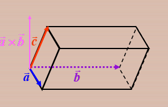

## 向量积

定义 ：$\vec{a},\vec{b}$的向量积为$\vec{c}=\vec{a}\times\vec{b}$  

$|\vec{c}|=|\vec{a}||\vec{b}|sin\theta$  

$\vec{c}$的方向右手系，是由$b$转向$a$来确定的

(1) $\vec{a}\times\vec{b}=-\vec{b}\times\vec{a}$    

(2) $\vec{a}\times\vec{a}=0$

$\overrightarrow{\boldsymbol{a}}=\boldsymbol{a}_{\boldsymbol{x}} \overrightarrow{\boldsymbol{i}}+\boldsymbol{a}_{\boldsymbol{y}} \overrightarrow{\boldsymbol{j}}+\boldsymbol{a}_{z} \overrightarrow{\boldsymbol{k}}, \quad \overrightarrow{\boldsymbol{b}}=\boldsymbol{b}_{\boldsymbol{x}} \overrightarrow{\boldsymbol{i}}+\boldsymbol{b}_{\boldsymbol{y}} \overrightarrow{\boldsymbol{j}}+\boldsymbol{b}_{\boldsymbol{z}} \overrightarrow{\boldsymbol{k}}$

$\overrightarrow{\boldsymbol{a}} \times \overrightarrow{\boldsymbol{b}}$  =$\left(a_{y} b_{z}-a_{z} b_{y}\right) \vec{i}+\left(a_{z} b_{x}-a_{x} b_{z}\right) \vec{j}+\left(a_{x} b_{y}-a_{y} b_{x}\right) \vec{k}$

$\vec{a} \times \vec{b}=\left|\begin{array}{ccc}\vec{i} & \vec{j} & \vec{k} \\ a_{x} & a_{y} & a_{z} \\ b_{x} & b_{y} & b_{z}\end{array}\right|$

注意：$|\vec{a}\times\vec{b}|$ 表示以$\vec{a}$和$\vec{b}$ 为领边的平行四边形的面积

## 向量的混合积

数量积 $(\vec{a}\times\vec{b})\bullet\vec{c}$ 称为这三个向量的混合积，记作$[\vec{a} \vec{b} \vec{c}]$

$[\vec{a} \vec{b} \vec{c}]=(\vec{a} \times \vec{b}) \cdot \vec{c}=\left|\begin{array}{ccc}a_{x} & a_{y} & a_{z} \\ b_{x} & b_{y} & b_{z} \\ c_{x} & c_{y} & c_{z}\end{array}\right|$

向量积的绝对值表示以$\vec{a},\vec{b},\vec{c}$为棱的平行六面体的体积

三向量共面，$[\vec{a} \vec{b} \vec{c}]=0$