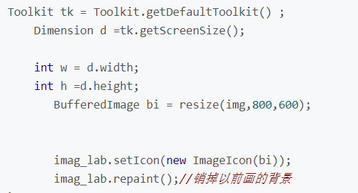
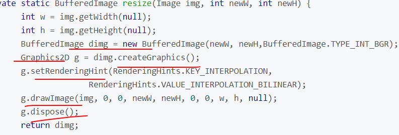

过程

1：将当前屏幕的显示内容捕捉为图片
2：将捕捉的图片发送到远程控制主机
3：远程控制主机接收到在本地显示
4：利用多线程重复上面三步达到实时更新

---

BufferedImage  ImageIO

ImageIcon

Toolkit   Tookit.getDefaultTookit()

Dimension

1）：创建一个Graphics2D，可以画到BufferedImage中。

BufferedImage  buf=new BufferedImage(img.getWidth(this),img.getHeight(this),BufferedImage.TYPE_INT_ARGB);

创建一个临时Graphics2D对象。

Graphics tmpG=buf.createGraphics();

将图像画入临时缓冲中：

tmpG.drawImage(img,10,10,this);