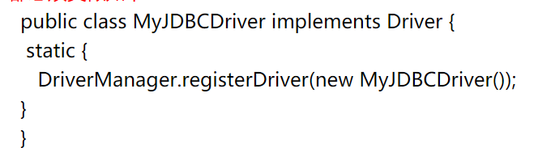
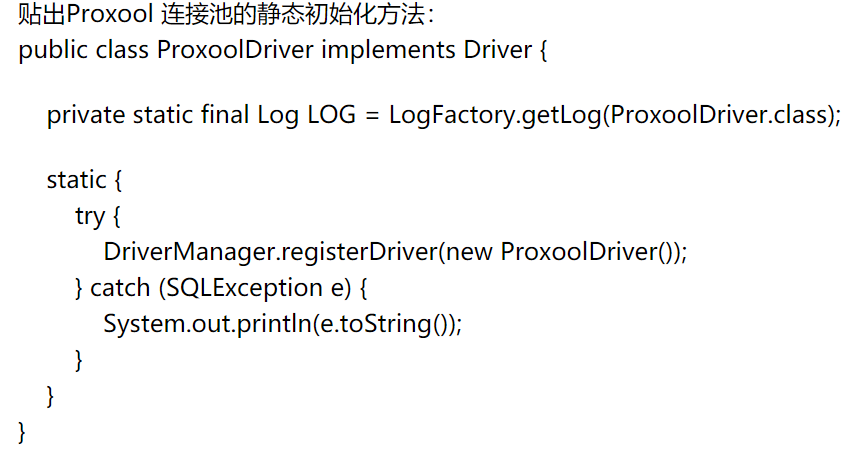

## 主要功能

Class.forName(xxx.xx.xx)返回的是一个类

Class.forName(xxx.xx.xx)的作用是要求JVM查找并加载指定的类，也就是说<font color = "red">JVM会执行该类的静态代码段。</font>


### 用法

#### 1、类的包名和类名 ---> 实例化类

> A   a =  (A)  Class.forName("pacage.A").newInstance();

和 `A a = new A()`效果一样

#### 2、动态加载和创建Class 对象，比如根据用户输入的字符串创建对象

```java
String str = "用户输入的字符串";
Class t = Class.forName(str);
t.newInstance();
```

> Class.forName("  ")：返回的是类
>
> ClassforName("   ").newInstance() 返回的是object

> newInstance() ：弱类型，低效率， 只能调用无参构造 --->  方法
>
> new:：强类型，高效，能调用任何public构造


**动态加载类的好处**

```java
那么为什么会有两种创建对象方式？这主要考虑到软件的可伸缩、可扩展和可重用等软件设计思想。

// Java中工厂模式经常使用newInstance()方法来创建对象，因此从为什么要使用工厂模式上可以找到具体答案。 例如：
class c = Class.forName(“Example”);
factory = (ExampleInterface)c.newInstance();

// 其中ExampleInterface是Example的接口，可以写成如下形式：
String className = “Example”;
class c = Class.forName(className);
factory = (ExampleInterface)c.newInstance();

进一步可以写成如下形式：
String className = readfromXMlConfig;//从xml 配置文件中获得字符串
class c = Class.forName(className);
factory = (ExampleInterface)c.newInstance();

上面代码已经不存在Example的类名称，它的优点是，无论Example类怎么变化，上述代码不变，甚至可以更换Example的兄弟类Example2 , Example3 , Example4……，只要他们继承ExampleInterface就可以。任意创建实例化(接口实现类)
```


3. #### new 和 newInstance() 创建类的区别

- 前者是创建一个新类，后者是使用了类加载机制

- 从JVM的角度看，使用new创建一个类的时候，这个类可以没有被加载。

- 使用newInstance()方法的时候，必须保证 1.这个类已经加载 2. 这个类已经连接

完成上面两个步骤的正是<mark>Class 的静态方法 forName()</mark>完成的，这个静态方法调用了启动类加载器。


#### 4.加载数据库驱动只用Class.forName()

Class.forName("");的作用是要求JVM查找并加载指定的类，如果在类中有静态初始化器的话，JVM必然会<mark>执行该类的静态代码 段</mark>

> 在JDBC规范中要求这个Driver类必须向DirverManager注册自己，即任何一个JDBC Driver类的代码都必须类似如下：

	

既然在静态初始化器的中已经进行了注册，所以我们在使用JDBC时只需要Class.forName(XXX.XXX);就可以了，调用Class.forName之后，再调用static代码块，就可以实现类的实例化。




