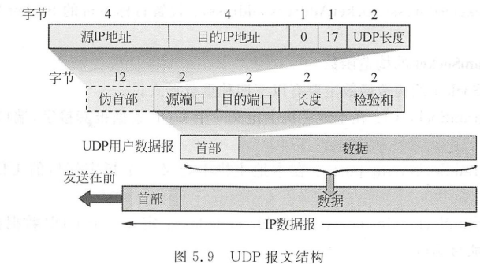
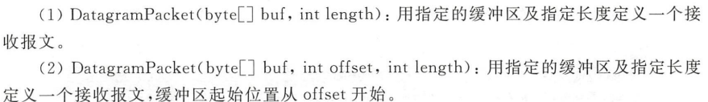
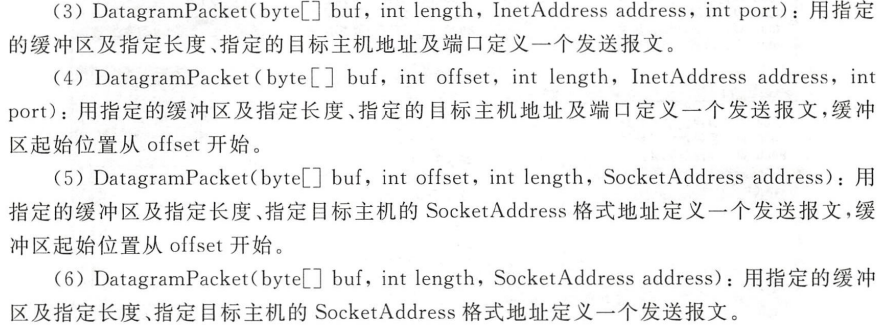
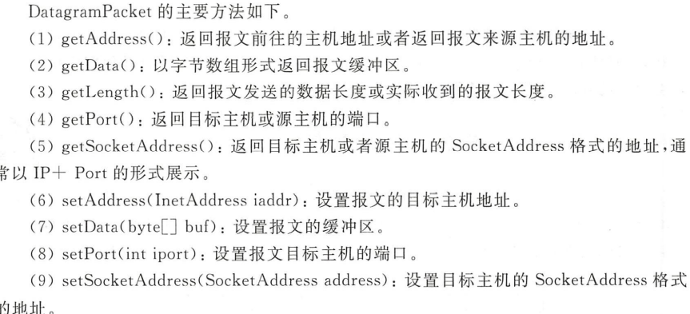
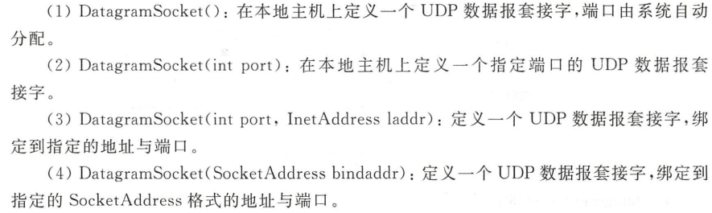
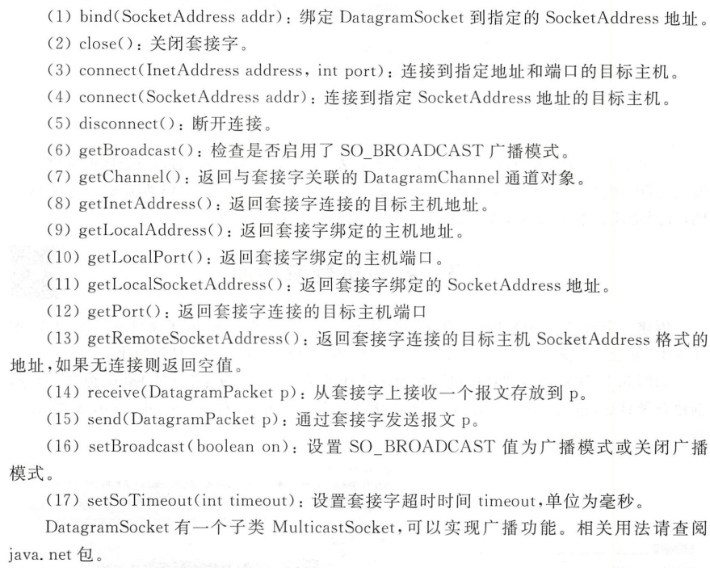
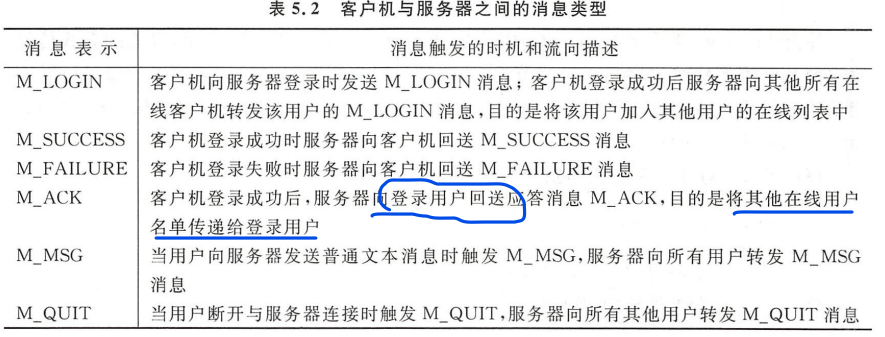
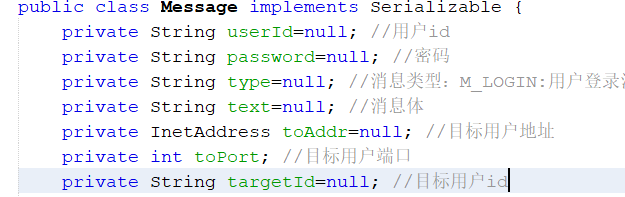
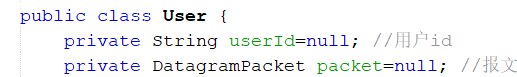
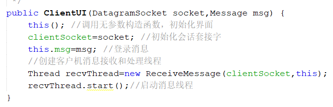

# UDP通信

java.net中定义了支持UDP协议通信的两个类：`DatagramPacket(定义报文结构)`和`DatagramSocket(用于发送和接收报文)`。

- `DatagramPacket`构造函数

**接收报文**

**发送报文**

- `DatagramPacket`主要方法

----

- `DatagramSocket`的构造函数

- `DatagramSocket`主要方法

## QQUDP编程程序理解

首先功能是可以多用户登录，系统预置了若干个用户(暂时还未设置注册和找回密码等功能)。

### 消息协议

| 消息表示  | 消息描述                                                     |
| --------- | ------------------------------------------------------------ |
| M_LOGIN   | client向server登录时发送M_LOGIN消息；client登录成功后server向其他所有在线client转发该用户的M_LOGIN消息，目的是让其他用户加入各自的在线列表中(提醒所有用户有新的用户登录在线) |
| M_SUCCESS | client登录成功后server向client回送M_SUCCESS消息，弹出新的对话窗口，同时关闭登录窗口 |
| M_FAILURE | client登录失败后server向client回送M_FAILURE消息，提醒client登录失败 |
| M_ACK     | client登录成功后，server向登录用户回送应答消息M_ACK,将其他在线用户的id发送给登录用户 |
| M_MSG     | client向server发送普通文本消息时，server向所有client转发M_MSG |
| M_QUIT    | 当client断开服务器连接时，触发M_QUIT，server向所有其他用户转发M_QUIT消息 |

消息体

用户类

### 用户程序

用户登录Login.UI

- 登录按钮添加响应事件，转发`M_LOGIN`消息给Server，
- 接收Server回送的消息，判断消息类型是否是`M_SUCCESS`、`M_FAILURE`
- 若成功`M_SUCEESS`：则启动client聊天界面(传入当前的UDP套接字和消息体)，

Client对话界面

- Client初始化函数有两个参数

- 启动<mark>接收和处理消息线程</mark>(把当前对话的UDP套接字和对话窗口对象参数传入)

消息接收和处理线程

- 有一个列表用于存储当前在线用户

- 分别对不同类型的消息进行处理，run()函数中一直循环判断接收到的消息类型并进行分类的操作，比如刚开始登录成功后，Server会回送一个`M_ACK`消息，它会把其他在线用加入在线列表

Client发送消息

- Client发送消息被绑定在发送按钮的响应事件中，直接利用UDP向Server发送自定义消息即可

### 服务器程序

服务器界面

- 启动服务器按钮：创建UDP套接字，指定端口侦听
- 创建并启动UDP消息接收线程(参数为   UDP套接字和当前窗口this)

接收和处理消息线程

- 用户列表userList
- 在run()方法中循环处理收到的各种消息
- 判断消息类型
- 如果消息为`M_SUCCESS`，向其他所有在线用户发送`M_LOGIN`消息，同时向新登录者发送整个用户列表(`M_ACK`)
- Server收到`M_MSG`和`M_QUIT`消息后，向其他所有在线用户转发收到的`data`数组即可。

