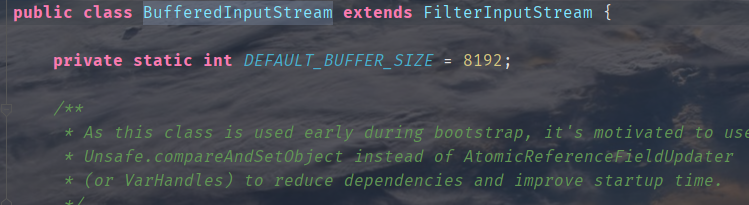
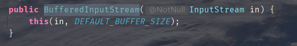
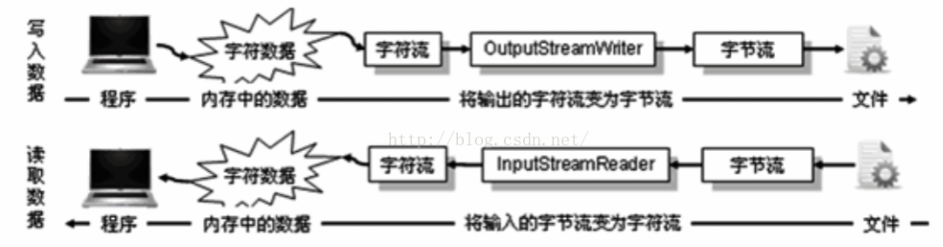

# IO流与文件传输

## 1.File类的使用

- `java.io.File`类： 文件和文件目录路径的抽象表示形式，与平台无关
- File 能新建、删除、重命名文件和目录，但不能访问问价内容本身，如果需要<mark>访问文件内容本身</mark>，则需要输入\输出流
- 在程序中表示一个真实存在的文件或目录，必须有一个File对象，但java程序中的一个`File`对象，可能没有一个真实存在的文件或目录

`File(String filepath)`：创建file对象，可以是相对或绝对路径

`File(String parentPath,String childPath)`：父路径、子路径

`File(File paretnFile,String childPath)`：父File对象、子文件路径


```java
@Test
    public void test() {
       // 构造器1
        // 可能硬盘中并不存在这个文件
        File file1 = new File("hello.txt");
        File file2 = new File("F:\\javaFIle\\2021_789\\day06\\src\\com.txt");

        System.out.println(file1);
        System.out.println(file2);

        // 构造器2
        File file3 = new File("D:\\\\workspace_idea1","java");
        System.out.println(file3); // D:\workspace_idea1\java

        // 构造器3
        File file4 = new File(file3,"hi.txt");
        System.out.println(file4); // D:\workspace_idea1\java\hi.txt
    }
```


### 1.1File类的常用方法

```java
	public String getAbsolutePath():获取绝对路径
    public String getPath():获取路径
    public String getName()：获取名称
    public String getParent()：获取上层文件目录路径
    public long length()：获取文件长度，不能获取目录长度
    public long lastModified()：获取最后一个修改的时间


         * public boolean isDirectory()：判断是否是文件目录
         * public boolean isFile() ：判断是否是文件
         * public boolean exists() ：判断是否存在
         * public boolean canRead() ：判断是否可读
         * public boolean canWrite() ：判断是否可写
         * public boolean isHidden() ：判断是否隐藏
         */


     * 创建硬盘中对应的文件或文件目录
     * public boolean createNewFile() ：创建文件。若文件存在，则不创建，返回false
     * public boolean mkdir() ：创建文件目录。如果此文件目录存在，就不创建了。如果此文件目录的上层目录不存在，也不创建。
     * public boolean mkdirs() ：创建文件目录。如果此文件目录存在，就不创建了。如果上层文件目录不存在，一并创建
     *
     *     删除磁盘中的文件或文件目录
     * public boolean delete()：删除文件或者文件夹
     *     删除注意事项：Java中的删除不走回收站。
     */
        
        
        如下的两个方法适用于文件目录：
     * public String[] list() ：获取指定目录下的所有文件或者文件目录的名称数组
     * public File[] listFiles() ：获取指定目录下的所有文件或者文件目录的File数组
```


> 利用 `list()`和`listFiles()` 方法获取目录中的文件(搜索  .jpg 文件)

```java
 @Test
    public void test() {
        File srcFile = new File("C:\\Users\\jun Ding\\Pictures\\壁纸");
        String [] fileNames = srcFile.list();
        for(String filename : fileNames) {
            if (filename.endsWith(".jpg")) {
                System.out.println(filename);
            }
        }
    }
    @Test
    public void test1() {
        File srcFile = new File("C:\\Users\\jun Ding\\Pictures\\壁纸");

        File[] listFiles = srcFile.listFiles();
        for(File file : listFiles) {
            if(file.getName().endsWith(".jpg")) {
                System.out.println(file.getAbsolutePath());
            }
        }
    }
```

> 遍历指定目录所以文件名称，包括子文件目录中的文件
>
> ​	计算指定目录所占空间的大小
>
> ​	删除指定文件目录及其下的所有文件

```java

/** 遍历指定目录所以文件名称，包括子目录中的文件
 * 1、计算指定目录所占空间大小
 * 2、删除指定文件目录及其下的所有文件
 * @author DingJun
 * @date 2021/8/11 15:37
 */
public class ListFilesTest {
    public static void main(String[] args) {
        // 1、创建目录对象
        File dd = new File("D:\\io");

        // 2.打印目录的子文件
//        printSubFile(dd);
//        listAllSubFiles(dd);
        getDirectorySize(dd);
        deleteDirectory(dd);
    }
 	
    // 递归打印目录中的所有文件
    private static void printSubFile(File t) {
        File [] subfiles = t.listFiles(); // 获取各文件File对象

        for(File f : subfiles) {
            if(f.isDirectory()) { // 文件目录
                printSubFile(f); // 递归
            }else {
                System.out.println(f.getAbsolutePath());
            }
        }
    }

    // 方式二：  循环实现
    public static void listSubFiles(File file) {
        if(file.isDirectory()) {
            String [] all = file.list(); // 获取文件String
            for(String s : all) {
                System.out.println(s);
            }
        }else {
            System.out.println(file + "是文件");
        }
    }

    // d
    public static void listAllSubFiles(File file) {
        if (file.isFile()) {
            System.out.println(file);
        }else {
            File[] all = file.listFiles();

            for(File f : all) {
                listAllSubFiles(f);
            }
        }
    }

    // 求指定目录所在空间的大小
    public static long getDirectorySize(File file) {
        long size = 0;
        if(file.isFile()) {
            size += file.length();
        } else {
            File [] all = file.listFiles(); // 获取file的下一级
            // 累加size
            for(File f : all) {
                size += getDirectorySize(f);
            }
        }
        return size;
    }

    // 删除指定的目录
    public static void deleteDirectory(File file) {
        if(file.isDirectory()) { // 遍历目录中的文件或小目录
            File [] all = file.listFiles();

            for(File f : all) {
                deleteDirectory(f); // 递归删除
            }
        }
        file.delete(); // 删除自己
    }
}
```

## 2.IO流


### 2.1 IO流原理

- I/O是Input/Output的缩写，用于处理设备之间的数据传输，如读写文件、网络通讯等。
- java程序中，对于数据的输入/输出操作以“流”的方式进行。
- 输入input：读取外部数据(磁盘、光盘等存储设备的数据) 到 程序(内存)中
- 输出output：将程序(内存)数据输出到磁盘、光盘等存储设备中。


### 2.2 流的分类

- 按操作<mark>数据单位</mark>不同分为：字节流(8 bit) 和 字符流(16 bit)
- 按数据流的<mark>流向</mark>不同：输入流，输出流
- 按流的<mark>角色</mark>不同分为：节点流、处理流

| 抽象基类 | 字节流       | 字符流 |
| -------- | ------------ | ------ |
| 输入流   | InputStream  | Reader |
| 输出流   | OutputStream | Writer |


## 3.缓冲流

### 3.1缓冲流的优点及实现原理

- 不带缓冲流的工作原理：

  读取一个字节/字符，就会向用户指定的路径写出去，读一个写一个，频繁的读写增加了读写次数，降低了效率。

- 带缓冲流的工作原理：

   读取到一个字节/字符，先不输出，等凑足了<mark>缓冲的最大容量</mark>后一次性写出去，减少 了读写次数，提高了效率。

**缺点**：接收端可能无法<mark>及时获取到数据</mark>


### 3.2 缓冲流的使用

- JavaApI提供了带缓冲功能的流类，在使用这些流类时，会从创建一个内部缓冲数组，缺省使用8192个字节(8Kb)的缓冲区。

  




- 缓冲流要<mark>套接在相应的节点流</mark>之上，根据数据操作单位可以把缓冲流分为：
  - `BufferedInputStream`和`BufferedOutputStream`
  - `BufferedReader`和`BufferedWriter`
- 读取数据时，数据块读入缓冲区，其后的读操作则直接<mark>访问缓冲区</mark>

- 当使用BufferedInputStream读取字节文件时，BufferedInputStream会一次性从文件中读取8192个(8Kb)，存在缓冲区中，直到缓冲区装满了，才重新从文件中读取下一个8192个字节数组。
- 向流中写入字节时，<mark>不会直接写到文件</mark>，先写到缓冲区直到缓冲区满，`BufferedOutputStream`才会把缓冲区中的数据一次性写到文件里，使用方法`flush()`可以<mark>强制将缓冲区的内容全部写入输出流</mark>.

- 关闭流和打开流的<mark>顺序相反</mark>，只要关闭最外层流即可，关闭最外层也会相应关闭内存节点流
- `flush()`方法的使用，手动将buffer中的内容写入文件
- 如果是带缓冲区的流对象的close()方法，不但会关闭流，还会在关闭流之前刷新缓冲区，关闭后不能再写出

**缓冲区在内存中**


### 3.3练习

> 实现图片的加密和解密：将图片信息按照一定的加密方式加密后写入到新文件中，解密也就相当于逆运算。

```java
/** 练习一：实现图片的加密操作：字节流
 * @author DingJun
 * @date 2021/8/12 14:38
 */
public class PicTest {
    @Test
    public void test() {
//        C:\Users\jun Ding\Pictures\壁纸
        FileInputStream fis = null;
        FileOutputStream fos = null;

        try {
            fis = new FileInputStream("C:\\Users\\jun Ding\\Pictures\\壁纸\\5.jpg");
            // 测试.jpg中存储的是加密过的图片
            fos = new FileOutputStream("测试.jpg");

            byte [] buffer = new byte[20]; // 一个一个字节读出来
            int len;

            while ((len = fis.read(buffer)) != -1) {
                // 修改字节数组进行加密
                for(int i = 0;i < len;i++) {
                    buffer[i] =(byte) (buffer[i] ^ 5);
                }
                // 写出到文件
                fos.write(buffer,0,len);
//                for(int i = 0;i < len;i++) {
//                    System.out.println(buffer[i]);
//                }
            }

        } catch (IOException e) {
            e.printStackTrace();
        } finally {
            try {
                fos.close();
            } catch (IOException e) {
                e.printStackTrace();
            }
            try {
                fis.close();
            } catch (IOException e) {
                e.printStackTrace();
            }
        }
    }

    // 图片的解密
    @Test
    public void test2() {
        FileInputStream fis = null;
        FileOutputStream fos = null;

        try {
            fis = new FileInputStream("测试.jpg");
            fos = new FileOutputStream("解密图片.jpg");

            byte [] buffer = new byte[20];
            int len;
            while ((len = fis.read(buffer)) != -1) {
                for(int i = 0;i < len;i++) {
                    // 做相同的异或操作，逆运算
                    buffer[i] = (byte) (buffer[i] ^ 5);
                }
                fos.write(buffer,0,len);
            }
        } catch (IOException e) {
            e.printStackTrace();
        } finally {
            try {
                fos.close();
            } catch (IOException e) {
                e.printStackTrace();
            }
            try {
                fis.close();
            } catch (IOException e) {
                e.printStackTrace();
            }
        }
    }
}
```


> 获取文本文件中每个字符出现的次数

```java
/** 获取文本上每个字符出现的次数
 *
 * @author DingJun
 * @date 2021/8/12 15:10
 */
public class WordCount {
    /**
     * 说明：如果使用单元测试，文件相对路径为当前module
     *     如果使用main()测试，文件相对路径为当前工程
     */
    @Test
    public void testWordCount() {
        FileReader fr = null;
        BufferedWriter bw = null;

        try {
            // 1.创建Map集合
            Map<Character,Integer> map = new HashMap<Character, Integer>();

            // 2.遍历每个字符，每一个字符出现的次数放到map中
            //  read()：返回读入的第一个字符，如果到达文件末尾，返回-1
            //  返回值为0到255的int类型的值，返回值为字符的ACSII值
            fr = new FileReader("Test.txt");
            int c = 0;
            while ((c = fr.read()) != -1) {
                // int 还原char
                char ch = (char) c;
                // 判断ch是否在map中第一次出现
                if(!map.containsKey(ch)) {
                    map.put(ch,1); // 第一次出现
                } else {
                    map.put(ch,map.get(ch) + 1); // value次数加1
                }
            }

            // 3.把map中的数据放在txt文件中
            bw = new BufferedWriter(new FileWriter(new File("CountWord.txt")));
            // 也可以这样写:
//            bw = new BufferedWriter(new FileWriter("CountWord.txt"));

            // 4.遍历Map写入数据
            Set<Map.Entry<Character, Integer>> entrySet = map.entrySet();
            // 遍历键值对
            for(Map.Entry<Character,Integer> entry : entrySet) {
                switch (entry.getKey()) { // 键：出现的字符种类
                    case ' ':
                        bw.write("空格=" + entry.getValue());
                        break;
                    case '\t':
                        bw.write("tab=" + entry.getValue());
                        break;
                    case '\r':
                        bw.write("回车=" + entry.getValue());
                        break;
                    case '\n':
                        bw.write("换行=" + entry.getValue());
                        break;
                    default:
                        bw.write(entry.getKey() + "=" + entry.getValue());
                        break;
                }
                bw.newLine(); // 换行
            }
        } catch (IOException e) {
            e.printStackTrace();
        } finally {
            try {
                bw.close();
            } catch (IOException e) {
                e.printStackTrace();
            }
            try {
                fr.close();
            } catch (IOException e) {
                e.printStackTrace();
            }
        }
    }
}
```


## 4.处理流二：转换流

在整个IO包中，实际上就是分为字节流和字符流，除了这两个流之外，还存在了一组<mark>字节流-字符流的转换类</mark>

OutputStreamWriter：是Writer的子类，将输出的字符流变为字节流，一个字符的输出对象------>>>字节流的输出对象

InputStreamReader：是Reader的子类，将输入的字节流变为字符流，一个字节流的输入对象------->>>>字符流的输入对象

**有关字节--字符转换流**

https://blog.csdn.net/u013087513/article/details/51956801

---



以文件操作为例，在内存中的字符数据需要通过`OutputStreamWriter`变为<mark>字节流才能保存在文件</mark>中，读取的时候需要将读入的字节流通过`InputStreamReader`变为字符流。


### 4.1 FileWriter 和 FileReader的说明

FileOutputStream 和 FileInputStream是 OutputSteam 和 InputStream的直接子类，但是在<mark>字符流文件</mark>中的两个操作有些特殊，FileWriter 不是 Writer的直接子类，而是`OutputStreamWriter`的子类；OutputStreamWriter 不是 Reader的子类，而是`InputStreamReader`的子类。

查看两个类的继承关系可以发现 不管使用字节流还是字符流实际上最终都是以字节形式操作流的。

这么说，FileWriter和FileReader 都是转换流的子类

> 也就是说，最后不管如何，虽然是以字符的输出流形式操作了字节的输出流，但实际上还是以字节的形式输出，而字符的输入流，虽然以字符的形式操作，但实际上还是使用的字节流，也就是说，传输或者是从文件中读取数据的时候，文件中真正保存的数据永远是字节。


> FileWriter的另一种写法

```java
 @Test
    public void OutputStreamWriterDemo() throws IOException {
        File f = new File("Test.txt");
        Writer out = null; // 字符输出流
        out = new OutputStreamWriter(new FileOutputStream(f)); // 字符输出流--->字节输出流
        out.write("hello,world!");
        out.close();
    }
```

> FileReader的另一种写法

```java
 @Test
    public void InputStreamReaderTest() throws IOException{
        File file = new File("dest.txt");
        Reader reader = null;
        reader = new InputStreamReader(new FileInputStream(file)); // 字节流--->字符流i
        char [] c = new char[1024];
        int len = reader.read(c); // len 表示读取到的长度
        reader.close();
        System.out.println(new String(c,0,len));
    }
```


### 5、标准输入流、输出流

- `System.in`和`System.out`分别代表了系统标准的输入和输出设备
- `System.in`的类型是`InputStream`
- `System.out`的类型是`PrintStream`OutputStream的子类FilterOutputStream的子类


### 6、对象输出流ObjectOutputStream

#### 对象序列化

对象序列化机制允许把内存中的Java对象转换成平台无关的二进制流，从而允许把这种 \* 二进制流持久地保存在磁盘上，或通过网络将这种二进制流传输到另一个网络节点。当其它程序获取了这种二进制流，就可以恢复成原来的Java对象。

- 用于存储和读取基本数据类型数据或对象的处理流。它的强大之处就是可以把Java中的对象写入到数据源中，也能把对象从数据源中还原回来。
- 序列化：用ObjectOutputStream类保存基本类型数据或对象的机制
- 反序列化：用ObjectInputStream类读取基本类型数据或对象的机制


`public ObjectOutputStream(OutputStream out)` ：在文件输出流上套一个对象输出流

`writeObject`：写入对象

`flush()`：写入之后要记得刷新操作


`ObjectInputStream(InputStream In)`：构建输入流

`readObject()`：读取对象


### 7、字节数组流 ByteArrayOutputStream

https://www.cnblogs.com/zhaoyanjun/p/6394443.html

```java
InputStream ---> ByteArrayInputStream
OutputStream ---> ByteArrayOutputStream
```


字节数组输出流在内存中创建一个<mark>字节数组缓冲区</mark>，所有发送到输出流的数据<mark>保存在该字节数组缓冲区</mark>中，

`ByteArrayInputStream` 可以将字节数组转化为输入流 。
`ByteArrayOutputStream`可以捕获内存缓冲区的数据，转换成字节数组。


<mark>ByteArrayInputStream</mark>

```java
// 构造函数
public ByteArrayInputStream(byte buf[])
    // 准备从buf数组中读取
public ByteArrayInputStream(byte buf[],int offset,int len)
    
    
// 方法	
void close() // 关闭该流并释放资源
    
int read() // 读取单个字符，int，记得转类型(char)
    
int read(char[] cbuf,int offset,int len)

boolean ready() // 此流是否已经准备好用于读取
```


<mark> ByteArrayOutputStream</mark>


```java
// 构造函数
public ByteArrayOutputStream()

public ByteArrayOutputStream(int size) // 改变内置缓冲数组的大小
    
// 方法
    
// 将int类型的b换成byte类型，写入输出流
void write(int b)
//  写入字节数组到输出流中
void write(byte b[], int off, int len)
    
// 将"字节数组输出流"中的数据写入到输出流out中，
void writeTo(OutputStream out) 

byte toByteArray()[]  // 输出流转变为字节数组

void close()
    
```


### 8、打印流

- 将基本类型的数据格式转化为字符串输出
- PrintSteram和PrintWriter
  - 	 	提供了一系列重载的`print()`和`println()`，用于多种数据类型的输出
  - 	 	`PrintWriter`和`PrintStream`输出不会抛出IOException异常
  - 	 	有自动flush功能
  - 	 	`System.out`返回的是`PrintStream`的实例
  - 	 	PrintStream 打印的所有字符都使用平台的默认字符编码转换为字节。在需要写入字符而不是写入字节的情况下，应该使用PrintWriter 类


### 9、数据流

- DataInputStream 和 DataOutputStream
- 分别套接在 InputStream 和 OutputStream 子类的流上
- 方法

```java
boolean readBoolean()	byte readByte()
char readChar()	float readFloat()
double readDouble()	short readShort()
long readLong()	int readInt()
String readUTF()	void readFully(byte[s] b)
 
```

