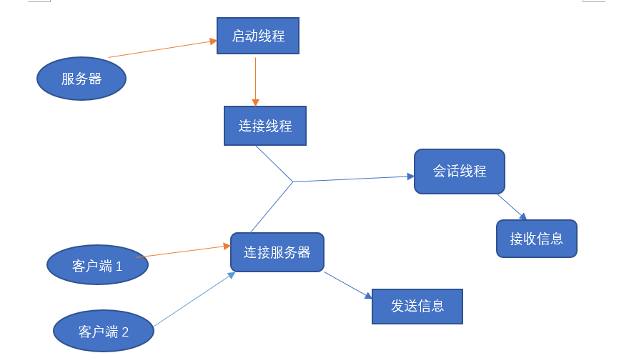

获取本地ip

```java
 initComponents();//在此处后面添加：

  try {

​      InetAddress addr = InetAddress.getLocalHost();

​      txtHostName.setText( addr.getHostAddress());
​    } catch (UnknownHostException e) {

​      e.printStackTrace();

​    }
```


## TCP 中常用的类和方法

### Socket类

`Socket(InetAddress address,int port)`

创建一个流套接字并

 

`Socket(String host,int port)`

创建一个流套接字并将其连接到指定主机上的指定端口号。

 

`Socket(InetAddress address,int port,InetAddress localAddr,int localPort)`

创建一个套接字并将其连接到指定远程地址上的指定远程端口

 

`Socket(String host,int port,InetAddress localAddr,int localPort)`

创建一个套接字并将其连接到指定远程主机上的指定远程端口。

 

`Close()`

关闭套接字

 

`Connect(SocketAddress endpoint)`

将此套接字连接到服务器。

```java
SocketAddress server = new InetSocketAddress(“localhost”,5000);

Socket clientSocket = new Socket();

clientSocket.connect(server);
```


`bind(SocketAddress serverAddr)`

```java
SocketAddress serverAddr = new InetSocketAddress(InetAddress.getByName(hostName),hostPort);
ServerSocket listenSocket = new ServerSocker(); // 创建侦听套接字
listenSocket.bind(serverAddr); // b
```


 

Connect(SocketAddress endpoint,int timeout) 设置一个超时值

 

`getInetAddress()` 返回套接字的地址


`getInputStream()` 返回套接字的输入流


`getLocalPort()` 返回此套接字绑定的本地端口

`getOutputStream()` 返回套接字的输出流 

`getPort()`   套接字连接的远程端口


### ServerSocket类

`ServerSocket(int port)`

创建绑定到特定端口的服务器套接字

`accept()`

侦听并接受到此套接字的连接

`getInetAddress()`

返回此服务器套接字的本地地址

 




**注意**

<mark>一个socket套接字通信分别对应这连接这个socket的两端服务器和客户端的输入输出流，这是一对的，因为socket构建了一个通信的流的通道，当存在多个用户连接时候，又会是一个新的socket---->从而又存在另一对通信流的输入输出流。</mark>


### TCP实现多个用户之间相互通信(即时聊天)

> **前面实现了服务器与多个客户端之间的通信，我们真正的目的是要实现多个客户端之间的通信**

**方案**

**客户端的数据包通过服务器中转，发送到另一个客户端**


实现步骤

1、对象序列化（对象需要在网络上传输）

> **数据包（发送消息者，接收消息者，消息类型（登录、发送），发送的消息内容）**

2.定义消息类型

>  **消息类型：登录、发送**

3、服务器

> **启动服务器、用动态序列容器Vector保存在服务器中保存的所有线程的任务对象、每个对象创建一个线程来处理**

4、客户端

> **启动客户端、发送登录信息、接收消息的线程、处理消息发送的线程**


代码实现

> 对象实例化

```java
public class Message implements Serializable {
 
    private String from; //发送者
    private String to;   //接收者
    private int type; //消息类型
    private String info;//消息包
 
    public Message() {
    }
 
    public Message(String from, String to, int type, String info) {
        this.from = from;
        this.to = to;
        this.type = type;
        this.info = info;
    }
 
    public String getFrom() {
        return from;
    }
 
    public void setFrom(String from) {
        this.from = from;
    }
 
    public String getTo() {
        return to;
    }
 
    public void setTo(String to) {
        this.to = to;
    }
 
    public int getType() {
        return type;
    }
 
    public void setType(int type) {
        this.type = type;
    }
 
    public String getInfo() {
        return info;
    }
 
    public void setInfo(String info) {
        this.info = info;
    }
}
```


> 消息类型

```java
public class MessageType {
 
    public static final int TYPE_LOGIN = 0x1; //登录消息类型
    public static final int TYPE_SEND = 0x2;  //发送消息的类型
}
```


> 服务器

```java
public class Server {
    public static void main(String[] args) {
        //保存客户端处理的线程
        Vector<UserThread> vector = new Vector <>();
        //固定大小的线程池，用来处理不同客户端
        ExecutorService es = Executors.newFixedThreadPool(5);
        //创建服务器端的Socket
        try {
            ServerSocket server = new ServerSocket(8888);
            System.out.println("服务器以启动，正在等待连接...");
            while(true){
                //接受客户端的Socket，若没有，阻塞在这
                Socket socket = server.accept();
                //每来一个客户端，创建一个线程处理它
                UserThread user = new UserThread(socket,vector);
                es.execute(user);  //开启线程
            }
        } catch (IOException e) {
            e.printStackTrace();
        }
    }
}
 
/**
 * 客户端处理线程：
 */
class UserThread implements Runnable{
    private String name; //客户端的用户名称，唯一
    private Socket socket;
    private Vector<UserThread> vector;   //客户端处理线程的集合
    private ObjectInputStream oIn;    //输入流
    private ObjectOutputStream oOut;  //输出流
    private boolean flag = true;  //标记
 
    public UserThread(Socket socket, Vector<UserThread> vector) {
        this.socket = socket;
        this.vector = vector;
        vector.add(this);    //把当前线程也加入vector中
    }
 
    @Override
    public void run() {
        try {
            //1、构造输入输出流
            System.out.println("客户端：" + socket.getInetAddress().getHostAddress() + "已连接！");
            oIn = new ObjectInputStream(socket.getInputStream());
            oOut = new ObjectOutputStream((socket.getOutputStream()));
            //2、循环读取
            while(flag){
                //读取消息对象
                Message message = (Message)oIn.readObject();
                //获取消息类型，登录还是发送消息
                int type = message.getType();
                //3、判断
                switch (type){
                    //如果是发送消息
                    case MessageType.TYPE_SEND:
                        String to = message.getTo();//发送给谁
                        UserThread ut;
                        //遍历vector，找到接收信息的客户端
                        int size = vector.size();
                        for (int i = 0; i < size; i++) {
                            ut = vector.get(i);
                            //如果名字相同，且不是自己，就把信息发给它
                            if(to.equals(ut.name) && ut != this){
                                ut.oOut.writeObject(message); //发送消息对象
                            }
                        }
                        break;
                    //如果是登录
                    case MessageType.TYPE_LOGIN:
                        name = message.getFrom();//获取用户名
                        message.setInfo("欢迎您！");//设置登录成功信息
                        oOut.writeObject(message);
                        break;
                }
 
            }
 
 
 
        } catch (IOException | ClassNotFoundException e) {
            e.printStackTrace();
        }
 
    }
}
```


> 客户端

```java
public class Client {
    public static void main(String[] args) {
        Scanner input = new Scanner(System.in);
        //单线程池
        ExecutorService es = Executors.newSingleThreadExecutor();
        try {
            //创建客户端
            Socket socket = new Socket("localhost", 8888);
            System.out.println("服务器连接成功！");
            //构建输出输入流
            ObjectOutputStream oOut = new ObjectOutputStream(socket.getOutputStream());
            ObjectInputStream oIn = new ObjectInputStream(socket.getInputStream());
            //1、客户端登录处理
            //向服务器发送登录信息（名字和消息类型）
            System.out.println("请输入名称：");
            String name = input.nextLine();
            //登录时，只自己的名字和消息类型为登录
            Message message = new Message(name, null, MessageType.TYPE_LOGIN, null);
            //发送给服务器
            oOut.writeObject(message);
            //服务器返回 欢迎信息
            message = (Message) oIn.readObject();
            //打印服务器返回的信息+当前客户端的名字
            System.out.println(message.getInfo() + message.getFrom());
            //2、启动读取消息的线程
            es.execute(new readInfoThread(oIn));  //读取线程完成
 
            //3、发送消息
            //使用主线程来发送消息
            boolean flag = true;
            //循环
            while(flag){
                //创建对象
                message = new Message();
                //发给谁
                System.out.println("To：");
                message.setTo(input.nextLine());
                //谁发的，从自己这发
                message.setFrom(name);
                //类型 发送消息
                message.setType(MessageType.TYPE_SEND);
                //发送的内容
                System.out.println("Info：");
                message.setInfo(input.nextLine());
                /*----到此需要发送的消息 对象 封装完毕----*/
                //发送给服务器
                oOut.writeObject(message);
            }
            
        } catch (IOException | ClassNotFoundException e) {
            e.printStackTrace();
        }
    }
}
 
/**
 * 读取其他客户端发来消息
 */
class readInfoThread implements Runnable {
    private ObjectInputStream oIn; //输入流 用来读操作
    private boolean flag = true; //标记
 
    public readInfoThread(ObjectInputStream oIn) {
        this.oIn = oIn;
    }
 
    public void setFlag(boolean flag) {
        this.flag = flag;
    }
 
    @Override
    public void run() {
 
        try {
            //循环 不断读取消息
            while (flag) {
                //读取信息
                Message message = (Message) oIn.readObject();
                //输出用户名+内容
                System.out.println("[" + message.getFrom() + "]对我说：" + message.getInfo());
            }
            //没有数据就关闭
           if(oIn != null){
               oIn.close();
           }
 
        } catch (IOException | ClassNotFoundException e) {
            e.printStackTrace();
        }
 
 
    }
}
开启服务器
```


