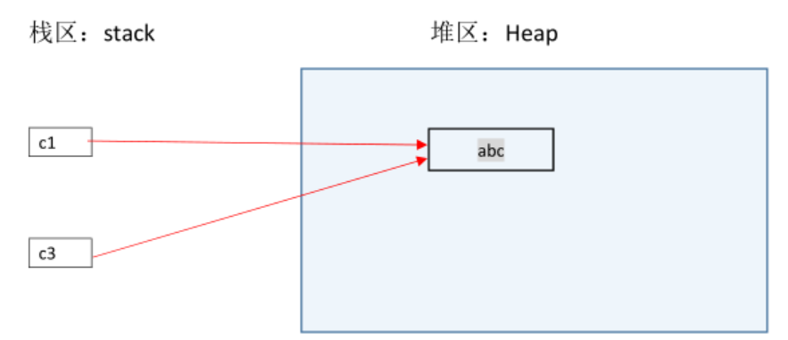
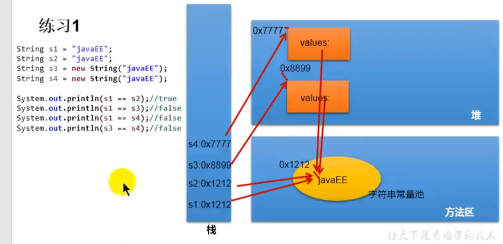
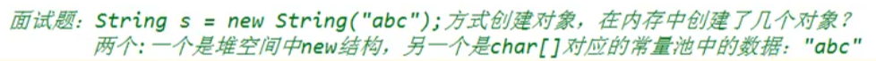
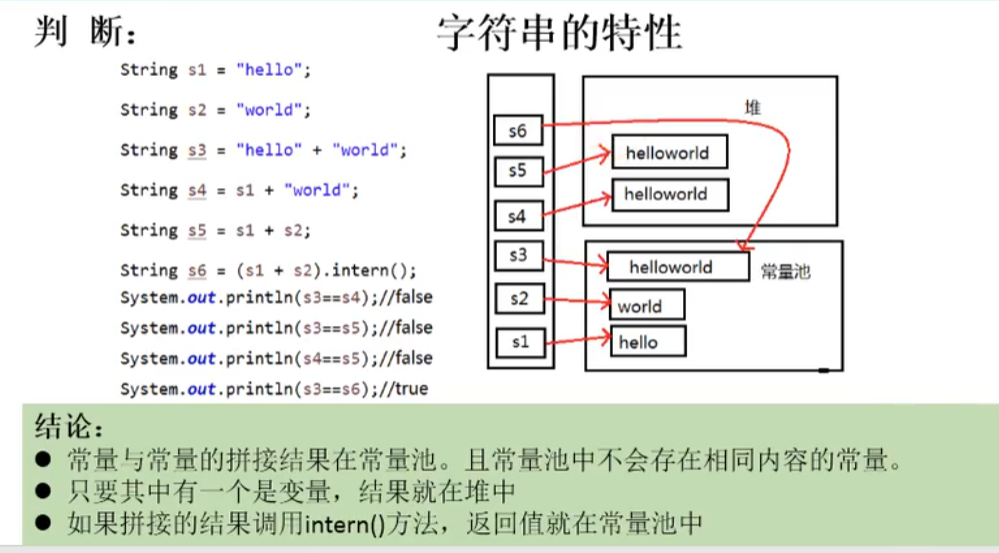
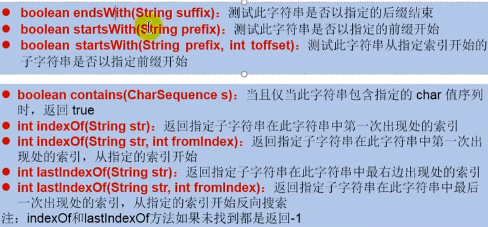
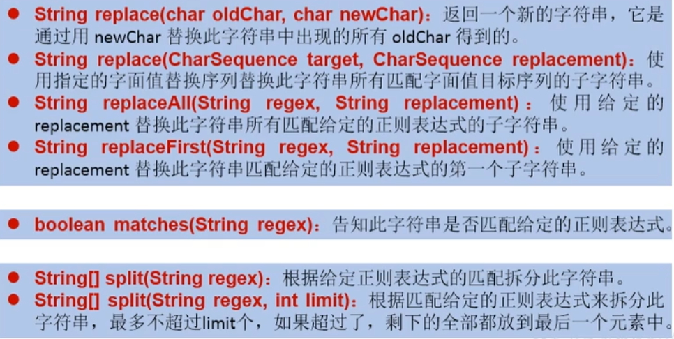

## Java常类

## 1、字符串相关类 String

- String 是一个final类，代表<mark>不可变</mark>的字符序列
- 字符串是<mark>常量</mark>，用双引号括起来，它们的值在创建之后不能更改

- String 实现类Serializable接口：表示字符串是支持序列化的
- 实现了Comparable接口：可以比较大小
- String内部定义了final byte[] value 用于存储字符串数据

一旦一个String对象在内存中创建，它将是不可改变的，所有的String类中方法并不是改变String对象自己，而是重新创建一个新的String对象。

例如：c1和c3都执行同一个对象"abc"，当执行语句`c1 = "han"`时，并没有改变堆中"abc"对象的值，而是重新创建了一个新的String对象，但此时c3的值仍然"abc"。



### 1.1String 创建方法

- 五种方法


```java
String s1 = "java";
String s2 = "java";
// 通过字面量定义的方式：此时的s1和s2的数据java声明在方法区中的字符串常量池中。
// ~~ s1 == s2  true
    
    
String s3 = new String("java");
String s4 = new String("java");
// 通过new的方式：此时的s3和s4保存的地址值，是在堆空间中开辟空间以后对应的地址值。
// s3 == s4  false

```





常量池中不会放两个相同的字符串

---

### 1.2字符串拼接的比较

```java
public class stringTest {
    @Test
    public void test1() {
        String s1 = "java";
        String s2 = "hadoop";
        String s3 = "javahadoop";
        String s4 = "java" + "hadoop"; // 两个字面量拼接变为一个字面量
        String s5 = "java" + s2; // 变量拼接，在堆中新建(和new类似)
        String s6 = s1 + "hadoop";
        
        System.out.println(s3 == s4); // true
        System.out.println(s3 == s5); // false
        System.out.println(s3 == s6); // false
        System.out.println(s5 == s6); // false
    }
}
```


> 常量与常量的拼接结果在常量池，且常量池中不会存在相同内容的常量。
>
> 只要其中有一个是变量，结果就在堆中	



---


### 1.3String常用方法

- s.length()：字符串的长度
- s.charAt(int index)：返回某索引处的字符
- s.isEmpty()：判断是否是空字符串
- s.toLowerCase()：将String中的所有字符转换为小写
- s.toUpperCase()：将String中的所有字符转换为大写
- s.trim()：返回字符串的副本，忽略前导空白和尾部空白
- s.equals()
- s.equalsIgnoreCase(String anotherString)：比较字符串，忽略大小写
- s.concat(String str)：等价于  "+"
- int compareTo(String anotherString)：比较两字符串大小
- String substring(int beginIndex)：
- String substring(int beginIndex,int endIndex)：返回一个新字符串，[begin,end)



---




