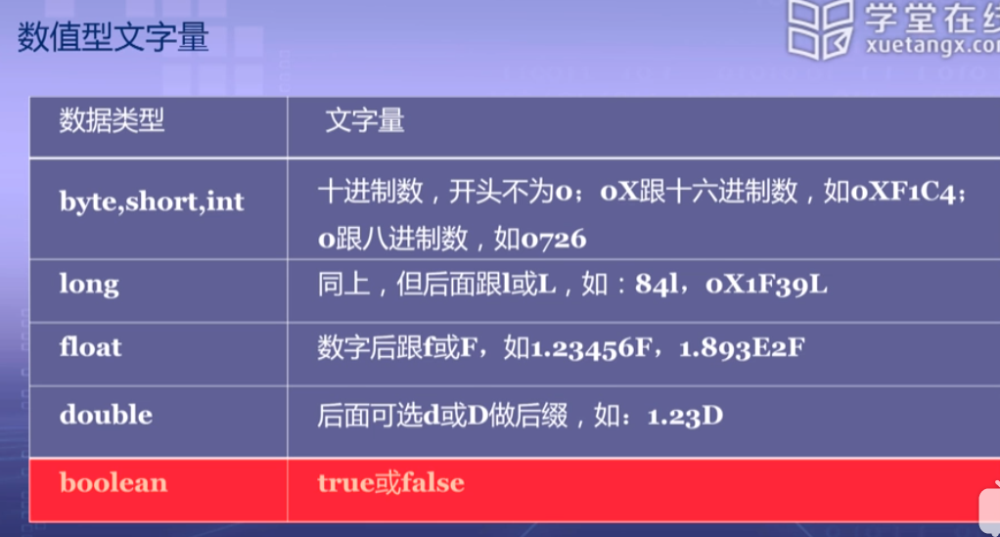

### 数值类型(基本类型)

| 类型   | 说明       | 长度 | 最小值      | 最大值                 |
| ------ | ---------- | ---- | ----------- | ---------------------- |
| byte   | 符号微整数 | 8位  | -128        | 127                    |
| short  | 符号短整数 | 16   | -$2^{15}$   | $2^{15}$-1             |
| int    | 带符号整数 | 32   | -$2^{31}$   | $2^{31}$-1             |
| long   | 符号长整数 | 64   | -$2^{63}$   | $2^{63}-1$             |
| float  | 单精度     | 32   | -$2^{-149}$ | $(2-2^{-23})*2^{127}$  |
| double | 双精度     | 64   | $2^{-1074}$ | $(2-2^{-52})*2^{1023}$ |



### 字符串


### 自动类型转换

从==范围小的数据转换成大==的数据为  ---> 自动类型转换

```java
public class DataCast {
	public static void main(String[] args) {
		byte b = 10;
		short s = b;
		int i = b;  //byte转换为short
		i = s;
		long i = b;
		l = s;
		l = i;
		
		char c = 'a';
		i = c;
		l = c;
		
		float f = 3.5f;
		double d = f;
		
		f = b;
		f = a;
	}
}
```


### 强制数据类型转换

```java
public class DataCast {
	public static void main(String[] args) {
		double d =3.5;
		float f = (float)d;
		System.out.println(f);
		
		int i = (int)d;
		System.out.println(i);
        
		i = 100;
		byte b = (byte)i;
		System.out.println(b);
		
	}
}
```


### 类中的数据成员和函数的访问权限

| 类型             | private | 无修饰 | protected | public |
| ---------------- | ------- | ------ | --------- | ------ |
| 同一类           | 是      | 是     | 是        | 是     |
| 同一包中的子类   | 否      | 是     | 是        | 是     |
| 同一包中的非子类 | 否      | 是     | 是        | 是     |
| 不同包中的 子类  | 否      | 否     | 是        | 是     |
| 不同包中的非子类 | 否      | 否     | 否        | 是     |

### 枚举类型

特点：

- 枚举定义实际上是定义了一个类；
- 所有枚举类型都隐含继承自java.lang.Enum，因此枚举类型不能再继承其他任何类；
- 枚举类型的类体中可以包含方法和变量；
- 枚举类型的构造方法必须是包内私有的或者私有的。定义在枚举开头的常量会被自动创建，不能显示地调用枚举类的构造方法。

```
enum Score{
	Excellent,
	Qualfied,
	Failed;
};
```


