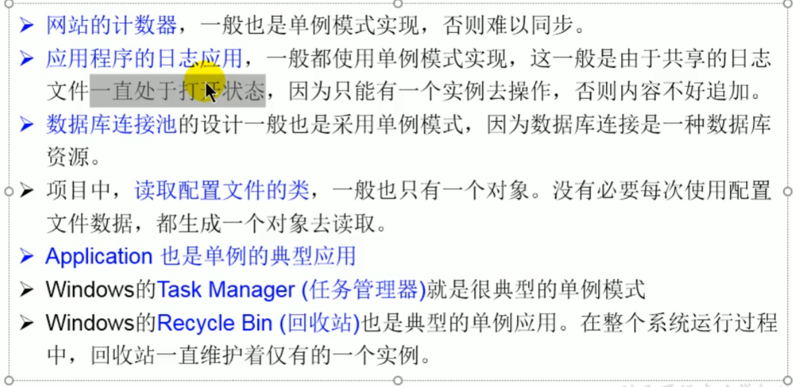

## 设计模式

是在大量的实践中总结和理论化之后优选的代码结构、编程风格、以及解决问题的思考方式。

### 单例设计模式

### 饿汉式(先new好)

采取一定的方法保证在整个的软件系统中，对某个类<mark>只能存在一个对象实例</mark>，并且该类只提供一个取得其对象实例的方法。

- 首先必须将类的构造器权限设置为private，这样就不能用new操作符在类的外部开始产生类的对象了。
  - 在类的内部产生该类的对象
  - 在类的外部只能<mark>调用该类的某个静态方法</mark>以返回类内部创建的对象

```java
public class SingletonTest1 {
    public static void main(String args[]) {
        Bank bank1 = Bank.getInstance(); // 只存在这一个对象实例，再次创建也是一样
    }
}
class Bank {
    // 1、私有化类的构造器
    private Bank() {
        
    }
    
    // 2、内部创建类的对象
    // 要求此对象也必须声明为静态的
    private static Bank instance = new Bank();
    
    // 3、提供公共的静态方法，返回类的对象
    public static Bank getInstance() {
        return instance;
    }
}
```


### 懒汉式

```java
// 懒汉式
public class SingletonTest2 {
    Order order1 = Order.getInstance();
    Order order2 = Order.getInstance();
    
    sout(order1 == order2); // 地址应该相同，内存中只有一个
}

class Order {
    // 1、私有化构造器
    private Order() {
        
    }
   
    // 2、声明当前类对象、没有初始化
    // 4、此对象也必须声明为static
    private static Order instance = null;
    
    // 3、声明一个public、static的返回当前类对象的方法
    public static Order getInstance() {
        if(instance == null) {
            instance = new Order();
        }
        return instance;
    }
}
```

### 单例模式应用

- 生成一个实例，减少了性能开销



