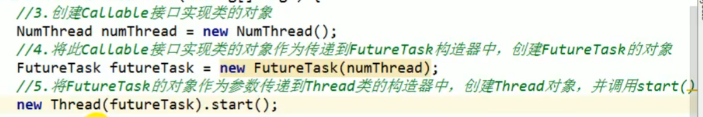
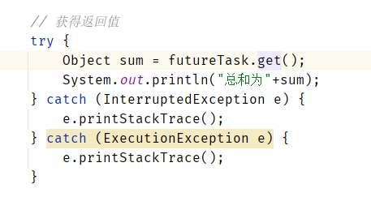
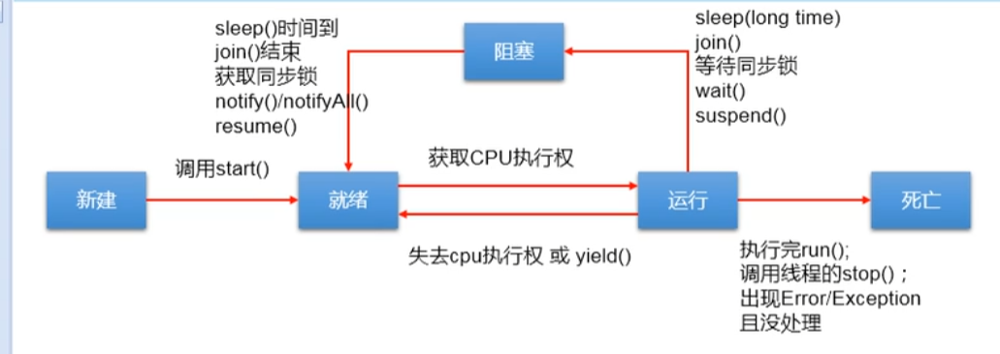

## 多线程创建方式一

### 方式一、继承Thread类

1、创建一个继承于Thread的子类

2、重写run()方法

3、创建Thread类的子类对象

4、通过对象调用start()方法

start方法的作用：启动当前线程  调用当前线程的run方法(启动一个新线程)

- 如果直接调用run()方法不会启动新线程，还是在主进程里执行。

- 不能让已经start()的线程再次执行第二次，需要再次新建一个

- 最终结果是交替执行，执行结果和顺序不确定


### 方式二、匿名子类

```java
public class ThreadDemo {
    public static void main(String[] args) {
        // 创建线程的匿名子类方法
        new Thread() {
            @Override
            public void run() {
                for(int i = 0;i < 100;i++){
                    if(i%2 == 0){
                        System.out.println(Thread.currentThread().getName()+":" + i);
                    }
                }
            }
        }.start();

        new Thread() {
            @Override
            public void run() {
                for(int i = 1;i < 100;i++){
                    if(i % 2 != 0){
                        System.out.println(Thread.currentThread().getName()+":" + i);
                    }
                }
            }
        }.start();
    }
}

```


## 线程常用方法

- start()：启动当前线程，调用当前线程的run()
- run()：通常需要重写Thread()方法
- String getName()：返回线程名称
- void setName(String name)：设置线程名称
- currentThread()：静态方法，<mark>返回执行当前代码的线程</mark>

Thread.currentThread().setName("")....

- yield()：释放cpu的执行权，有可能cpu还会执行此线程

- join()：在线程a中调用线程b的join方法，此时线程a进入阻塞状态，b进入运行态直到线程b完全执行完毕，线程a结束阻塞状态

- sleep(long milltime)：休眠阻塞一段时间


## 线程优先级

- 等级
  - MAX_PRIORITY: 10
  - MIN_PRIORITY: 1
  - NORM_PRIORITY: 5 默认的优先级

- 方法
  - getPriority()
  - setPriority()

优先级高的表示被cpu执行的概率高


## 线程创建二——实现Runnable接口

- 1、创建一个实现了Runnable接口的类

 *  2、实现类去实现Runnable中的抽象方法run()
 *  3、创建实现类的对象
 *  4、将此对象作为参数传递到Thread类的构造器中，创建Thread类的对象
 *  5、通过Thread类的对象调用start()方法

```java

/** 创建多线程Runnable接口
 *  1、创建一个实现了Runnable接口的类
 *  2、实现类去实现Runnable中的抽象方法run()
 *  3、创建实现类的对象
 *  4、将此对象作为参数传递到Thread类的构造器中，创建Thread类的对象
 *  5、通过Thread类的对象调用start()方法
 * @author DingJun
 * @date 2021/7/12 19:29
 */
// 1、创建一个实现了Runnable接口的类
class MThread implements Runnable {
    //  2、实现类去实现Runnable中的抽象方法run()
    @Override
    public void run() {
        for(int i = 0;i < 100; i++){
            if(i % 2 == 0){
                System.out.println(i);
            }
        }
    }
}
public class ThreadTest1 {
    public static void main(String[] args) {
        //  3、创建实现类的对象
        MThread mThread = new MThread();
        // 4、将此对象作为参数传递到Thread类的构造器中，创建Thread类的对象
        Thread t1 = new Thread(mThread);
        // 通过Thread类的对象调用start()
        // 1、启动进程
        // 2、调用当前线程的run()--->调用了Runnable类型target中的run
        t1.start();
    }
}
```

源码Thread的构造函数中有`public Thread(Runnable target)`的构造方法,源码中Thread.run()方法如下：

```java
public void run() {
    if(target != null) {
        target.run();
    }
}
```


### 比较创建线程的方式

优先选择实现Runnable接口的方式

**原因：** 1、实现方式没有类的单继承的局限性

2、实现的方式更适合处理多个线程有共享数据的情况

**联系：** `public class Thread implements Runnable `

都要重写run方法


## 线程安全问题

因为线程同步问题，cpu抢占时机不对而造成对共享资源的不正当访问而发生错误的现象。 

---


## 线程同步机制

### 方法一：同步代码块 <mark>synchronized</mark>

synchronized(同步监视器) {

​	// 需要被同步的代码(操作共享数据的代码)

​	// 这里面的代码当有线程进入时，则其他线程不能进入

}

<mark>同步监视器</mark>     锁：任何一个类的对象都可以充当锁

要求：多个线程必须<mark>共用同一把锁</mark>

补充：在实现Runnable接口创建多线程的方式中，我们可以使用this充当同步监视器

在继承Thread 类创建多线程的方式中，慎用this充当同步监视器，考虑使用当前类充当同步监视器。


### 方法二：同步方法

`public synchronized void run()`，在函数返回类型前面添加关键字

在同步代码内部是操作共享的代码，注意进行分割和组合

同步监视器：<mark>this</mark>

当使用同步方法对继承Thread类的多线程时，使用`static synchronized void show()`，同步监视器是当前的类(唯一的,Window.class)。

- 同步方法仍然涉及到同步监视器，只是不需要我们声明
- 非静态的同步方法，同步监视器是：this
- <mark>静态的同步方法</mark>，同步监视器是：当前类本身


### 方式三：LOCK(显式锁)

- 手动地启动同步(lock())，手动地关闭锁(unlock()).

```java
private ReentrantLock lock = new ReentrantLock();
lock.lock()
    ------
lock.unlock()
```


## 线程的通信

> `wait、notify、notifyAll`三个方法必须使用在<mark>同步代码块或同步方法</mark>中

>  这三个方法调用都省略了this(也就是当前对象)，注意要与<mark>同步代码块或同步方法中的同步监视器一致</mark>...

> 这三个方法都是定义在java.lang.Object类中。

```java
/** 线程通信，两个线程交替打印1到100
 * @author DingJun
 * @date 2021/7/13 21:04
 * wait(): 一旦执行此方法：当前线程进入阻塞状态，并释放同步监视器(锁)
 * notify()：唤醒wait的一个线程，如果有多个线程被wait，优先唤醒优先级高的线程
 * notifyAll()：唤醒所有被wait的线程
 */
class Number implements Runnable {
    private int num = 1;
    @Override
    public void run() {
        while (true) {
            synchronized (this) {
                // 唤醒线程
                notify();
                if(num <= 100) {
//                    try {
//                        Thread.sleep(1000);
//                    } catch (InterruptedException e) {
//                        e.printStackTrace();
//                    }
                    System.out.println(Thread.currentThread().getName() + ":" +num);
                    num++;

                    try {
                        // 使得当前进程进入阻塞状态
                        wait();
                    } catch (InterruptedException e) {
                        e.printStackTrace();
                    }
                }
            }
        }
    }
}
public class CommuncitionTest {
    public static void main(String[] args) {
        Number number = new Number();
        Thread t1 = new Thread(number);
        Thread t2 = new Thread(number);
        t1.start();
        t2.start();
    }
}

```

#### sleep()和wait()的异同

> 1、同：都可以使得当前的线程进入阻塞状态

> 2、不同： 1） 两个方法声明位置不同：Thread类中声明sleep()，Object类中声明	wait().

> 2）调用的范围要求不同：sleep可以在任何需要的场景调用。wait()必须使用在同步代码块或同步方法中.

> 3）关于是否释放同步监视器：如果两个方法都使用在同步dai'ma'k或同步方法中，sleep()不会释放锁，wait()会释放锁.

## 生产者和消费者例题

```java
package com.ding;


/** 消费者和生产者问题
 * 生产者将产品交给店员，消费者取走产品，店员一次只能持有固定数量的产品，如果生产者试图生产更多的产品，如果有空位放产品了再通知生产者
 * 继续生产；如果没有产品了，店员会告诉消费者等一下，如果店中有产品了再通知消费者来取走产品
 * 共享数据：店员、产品数量
 * @author DingJun
 * @date 2021/7/14 10:59
 */

class Clerk {

    private int productCount = 0;
    // 生产产品
    public synchronized void produceProduct() {
        if(productCount < 20) {
            productCount++;
            System.out.println(Thread.currentThread().getName() + ":开始生产第" + productCount + "个产品");
            // 唤醒消费者线程，此时店员处有产品
            notify();
        }else {
            // 等待
            try {
                wait();
            } catch (InterruptedException e) {
                e.printStackTrace();
            }
        }
    }
    // 消费产品
    public synchronized void consumerProduct() {
        if(productCount > 0) {
            System.out.println(Thread.currentThread().getName() + ":开始消费第" + productCount + "个产品");
            productCount--;
            // 唤醒生产者线程，此时产品被消费了一个肯定小于20
            notify();
        }else {
            // 等待
            try {
                wait();
            } catch (InterruptedException e) {
                e.printStackTrace();
            }
        }
    }
}
// 生产者线程
class Producer extends Thread {
    private Clerk clerk = new Clerk();

    public Producer(Clerk clerk) {
        this.clerk = clerk;
    }

    @Override
    public void run() {
        System.out.println(getName() + ":生产者开始生产...");

        while (true) {

            try {
                Thread.sleep(300);
            } catch (InterruptedException e) {
                e.printStackTrace();
            }
            clerk.produceProduct();
        }
    }
}
// 消费者线程
class Consumer extends Thread {
    private Clerk clerk = new Clerk();

    public Consumer(Clerk clerk) {
        this.clerk = clerk;
    }

    @Override
    public void run() {
        System.out.println(getName() +":消费者正在消费");
        while (true) {

            try {
                Thread.sleep(600);
            } catch (InterruptedException e) {
                e.printStackTrace();
            }
            clerk.consumerProduct();

        }
    }
}
public class TransportTest {
    public static void main(String[] args) {
        Clerk clerk = new Clerk(); // 声明店员对象
        // 共用同一个店员
        Producer p1 = new Producer(clerk);
        Consumer c1 = new Consumer(clerk);
        p1.setName("生产者");
        c1.setName("消费者");
        p1.start();
        c1.start();
    }
}

```


## 线程创建三

### 实现Callable接口

get返回值即为FutureTask构造器参数Callable实现类重写的call()的返回值

- 创建一个实现Callable接口的实现类 
- 实现call方法，将此线程需要执行的操作声明在call()中
- 创建Callable接口实现类的对象
- 将此Callable接口实现类对象传递到FutureTask构造器中，创建FutureTask对象
- 将FutureTask的对象作为参数传递到Thread类的构造器中，创建Thread对象，并调用start()..





> 实现Callable接口的方式创建多线程比实现Runnable接口更强大？
>
> - call()可以有返回值
> - call()可以抛出异常，被外面的操作捕获，获取异常的信息
> - Callable是支持泛型的

## 线程创建四——线程池

经常创建和销毁、使用量特别大的资源，比如并发情况下的线程，对性能影响比较大

- 提前创建好多个线程，放入线程池中，使用时直接获取，使用完放回池中。可以避免频繁创建销毁、实现重复利用

- 提高响应速度，降低资源消耗，便于线程管理

  ```java
  // 1、指定线程数量的线程池，ExecutorService是一个接口
  ExecutorService service = Executors.newFixedThreadPool(10);
  // 设置线程池的属性
  ThreadPoolExecutor service1 = (ThreadPoolExecutor) service;
  service1.setCorePoolSize(15);
  service1.setKeepAliveTime();
  maximumPoolSize();
  // 2、执行指定的线程操作，需要提供实现Runnable 接口或Callable接口实现类的对象
  service.execute(new NumThread());
  service.execute(new NumThread1()); // 适用于Runnable接口
  
  // service.submit(Callable callable); // 适用于Callable接口实现类
  // 3、关闭连接池
  service.shutdown();
  ```

上面的`ExecutorService`只是一个接口，ThreadPoolExeutor类实现了此接口，该类有设置线程池属性的方法，进行强转。


## 线程生命周期



- 暂停/挂起线程(suspend)和恢复线程(resume())---暂停线程意味着线程还可以恢复运行

