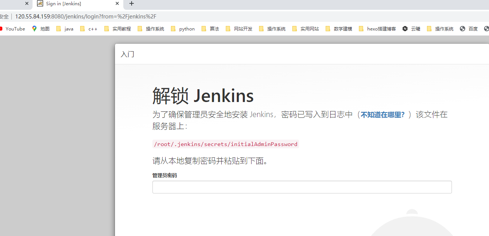

Jenkins


上传所需要的环境压缩包

```java
[root@jenkins ~]# yum install lrzsz -  // 安装rz命令
[root@jenkins ~]# rz 上传jdk1.8的压缩包
[root@jenkins ~]# rz    //上传apache-tomcat-7.0.94.tar.gz
[root@jenkins ~]# rz    //上传jenkins.war

```
1、配置JDK

```java
[root@jenkins ~]# tar xf jdk-8u211-linux-x64.tar.gz -C /usr/local
[root@jenkins local]# vim /etc/profile.d/java.sh
(写入以下内容)
#!/bin/bash
JAVA_HOME=/usr/local/java1.8
PATH=$JAVA_HOME/bin:$PATH
export JAVA_HOME PATH

[root@jenkins local]# # source /etc/profile.d/java.sh

```
java版本验证


解压apache这个压缩包 

把war包放到/usr/local/tomcat7/webapps目录，重启tomcat，就能够自动把jenkins.war包解压变成一个jenkins目录。


2、配置tomcat，启动jenkins服务进行访问

```java
[root@jenkins local]# tar xf apache-tomcat-7.0.94.tar.gz -C /usr/local // 解压tomcat压缩包
[root@jenkins local]# cd /usr/local
[root@jenkins local]# mv apache-tomcat-7.0.94/ tomcat7 // 改名
[root@jenkins local]# cp jenkins.war  /usr/local/tomcat7/webapps/ // 把jenkins.war放在webapps目录下
[root@jenkins local]# /usr/local/tomcat7/bin/startup.sh // 启动tomcat
[root@jenkins local]# netstat -tnlp // 查看8080端口
```


3、配置和安装jenkins

```java
 cat /root/.jenkins/secrets/initialAdminPassword

```

在jenkins机器中查看上述文件把密码输入到下面用于解锁jenkins。




进入jenkins主界面


点击新建任务`myapp_qqfarm`,在源码管理中点击`Git`，输入gitlab远程仓库git连接


上述无法连接的解决方法：在jenkins全局配置中安装git


在添加生成证书`cridential` privateKey中填入jenkins的私钥，将公钥给gitlab机器使用，方便加密传输。


jenkins同步项目文件夹

```java
[root@jenkins ~]# yum install nfs-utils -y // 安装nfs
[root@jenkins ~]# vim /etc/exports
    
/root/.jenkins/workspace/myapp_qqfarm 124.70.191.42(rw,sync,no_root_squash)
   // 可读可写，立即同步
 /root/.jenkins/workspace/myapp_qqfarm 124.71.168.100(rw,sync,no_root_squash)   
[root@jenkins ~]# systemctl restart nfs // 重启nfs服务

    // 验证
[root@jenkins ~]# showmount -e 120.55.84.159
Export list for 120.55.84.159:
/root/.jenkins/workspace/myapp_qqfram 124.71.168.100,124.70.191.42

```


构建触发器

定时发布   轮询发布   webhosts有更新时发布


