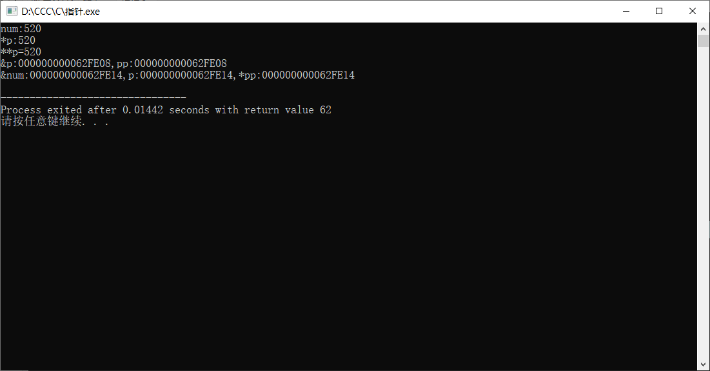

##  指向指针的指针

举例

```c
#include<stdio.h>

int main()
{
    int num=520;      //指针变量p存放的是num这个整型变量的地址.对p进行解引用得到num这个地址里面存放的值-也就是520        
    int *p=&num;  
    int **pp=&p;  //pp存放的是指针的地址，指向指针的指针；要进行两层解引用

	return 0;
}
```

 *p ------->num -------->520

*pp ------->p-------->&num

**pp-------->*p-------->num--->520

```c
#include<stdio.h>
int main()
{
	int num=520;
	int *p=&num;
	int **pp=&p;
	
	printf("num:%d\n",num);
	printf("*p:%d\n",*p);
	printf("**p=%d\n",**pp);
	printf("&p:%p,pp:%p\n",&p,pp);
	printf("&num:%p,p:%p,*pp:%p\n",&num,p,*pp);
}
```



## 指针数组

```c
#include<stdio.h>
int main()
{
	char *cBooks[]={
           "《c程序设计语言》",
		   "《c专家编程》",	
		   "《c和指针》",
		   "《c陷阱与缺陷》",
		   "《带你学c带你飞》",
	}
	char **byFishC; //指向指针的指针
	char **jiayuloves[4]; // []>**  优先级 数组里存放指向指针的指针
	
	byFishC=&cBooks[4]; //指针的地址
	jiayuloves[0]=&cBooks[0];
	jiayuloves[1]=&cBooks[1];
	jiayuloves[2]=&cBooks[2];
	jiayuloves[2]=&cBooks[3];
	return 0; 
}
```

## 数组指针和二维数组

```c
#include<stdio.h>

int main()
{
	int arry[3][4]={{0,1,2,3},
	             {4,5,6,7},
				 {8,9,10,11}};
				 
	
	int **p= arry;
	int i;
  printf("p:%p,arry:%p\n",p,arry);
  printf("p+1：%p,arry+1:%p\n",p+1,arry+1);
   
	return 0;
 } 
```

可以知道 p存放的地址和 arry 一样

但 p+1 和  arry+1 就不一样了

若 **p=arry[5], 则 *p[5]=arry[5]  指向指针 的地址

*p=arry[5],则 p[5]=arry[5]

==利用指针指向二维数组==

```
int (*p)[4]=arry;
printf("2%d",*(*(p+i)+j));
//p指向的任然是一维数组，把二维数组的首地址给了p，p的跨度是4(列地址)
p+1 二维数组第二行的地址

```

p指向的是包含4个元素的数组  

优先级                 ==()>[]>*==