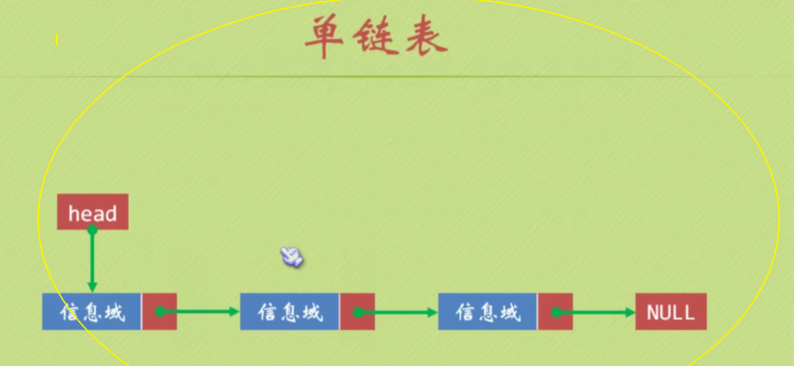
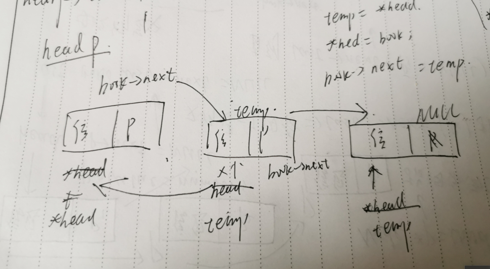

# 链表

## 链表的结构与定义方式

### 使用$typedef$ 定义

``` c
struct node{
int data;
struct node*  next;

}
typedef struct node node_t;
typedef struct node* nodeptr_t; /*这里是定义一个指向struct node类型的指针
```

开始让  head  指向链表的信息头，动态分配 malloc(sizeof(node_t)) 

head=malloc(())...   

参考翁恺老师的方式较为简明：

```c
typedef struct node{
int value;
struct _node*  next;
}Node;
int main(int argc,char const *argv[])
{
	Node * head=NULL;
	int number;
	do{
	scanf("%d",&nubmer);  //先输入数字这里用-1表示循环结束条件
	if(number!=-1){
	//把数字加入到链表节点后
	
	Node*p=(Node*)malloc(sizeof(Node)); //先定义一块内存
	p->value=number;
	p->next=NULL; //这里的结构体指针先不指向任何位置NULL
	//接下来就要找链表最后的那个节点(也就是那个指针部分指向NULL的地方)
    Node *last=head;
        if(last){
            while(last->next){
                last=last->next; //从head开始寻找，当next指向下一个数据域，继续移动last的指向，直到last->next=NULL
            }     
            lase->next=p; //让其指向下一个内存区域
        }
        else{
            head=p; //这是开始head没有指向时先让其指向p(malloc)
        }
        
	}
	}while(number!=-1) //终止循环的条件...
}
```

参考b站小甲鱼的定义方式：==头插法==

```c++
#include<stdio.h>
#include<stdlib.h>
struct Book
{
	char title[125];
	char author[40];
	struct Book *next;
	
};
void getInput(struct Book *book)
{
	printf("请输入书名: ");
	scanf("%s", book->title);
	printf("请输入作者: " );
	scanf("%s",book->author);
}
void printBook(struct Book* head)
{
    struct Book* book;
    int count =1;
    
    book=head;
    while(book!=NULL)
    {
        printf("Book%d:",conut);
        printf("书名:%s",book->title);
        printf("作者:%s",b00k->author);
        boook=book->next;
    }
}
void releaseBook(struct Book* head)
{
    while(head!=NULL)
    {
        free(head);
        head=head->next;
    }
}
void addBook(struct Book **head)   //我门要修改的是head的值所以后面使用的都是*head是一样的意思，只是多了一层
    
{
    
	struct Book* book,*temp;
	book=(struct Book *)malloc(sizeof(struct Book));
	if(book==NULL)
	{
		printf("内存分配失败\n");
		exit(1);
	}
	
	getInput(book); //存储数据
	
	if(*head!=NULL)
	{
		temp=*head;
		*head=book;
		book->next=temp;  //使用一个临时变量这样可以改变*head 的指向
	}
	else{
		*head=book;
		book->next=NULL;  //开始的*head=NULL 先使其指向一个节点.
		
	}
	
	
	
}
int main(void)
{
	struct Book *head= NULL;
	addBook(&head); //一次就是一个节点
	addBook(&head);
	return 0;
}

```






