## 添加图书

表单中属性的name值最好和Bean类对象一样

bug：当用户提交完浏览器会记录最后一次请求的全部信息，按F5刷新就会发起浏览器的最后一次请求，添加图书.不能用转发(一次请求)

resp.senRedirect("");// 重定向

https://blog.csdn.net/u012877472/article/details/50804568请求转发和重定向的区别

## 删除图书

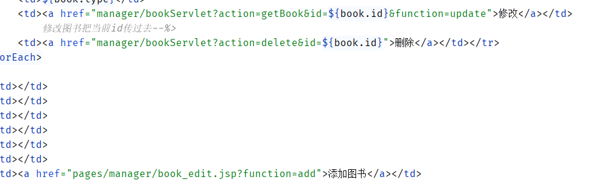

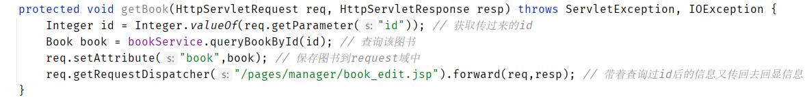

## 修改图书

BookServlet中添加一个函数getBook()返回要修改图书的id，并进行回显

最终都会跳回到book_edit.jsp中，那么function参数变量的值也会传过去，最后book_edit又会传到BookServlet中可用判断update还是add。

## 分页

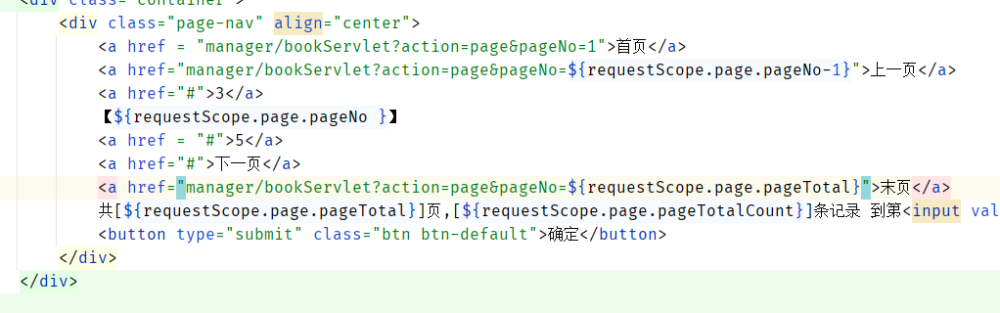

尾部分页条上一页、下一页、首页和末页...

先发送数据到BookServlet中，获取和处理分页信息，这里使用到了BookService中的两个方法

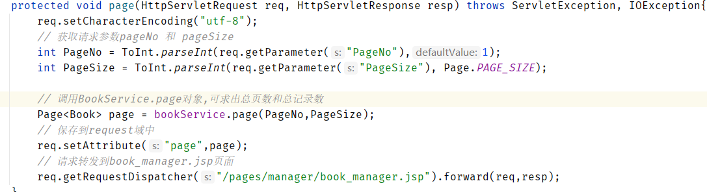

然后设置request域中的数据保存，再转发到book_manager.jsp中进行显示。

**防止上一页、下一页越界**

在选择任意页码的时候，点击没有按钮没有反应，原来是click是在js文件中，引用的路径写错了，

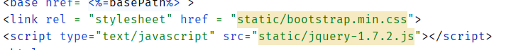

**总页码**数据边界的有效检查

BookServiceImpl.java中修改

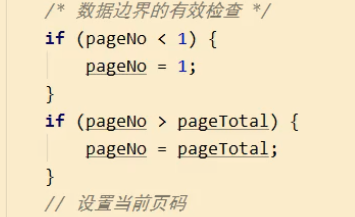

## 防止分页对添加删除的影响

book_edit.jsp

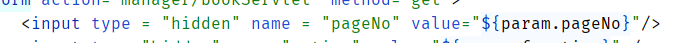

添加图书BookServlet跳转到最后一页

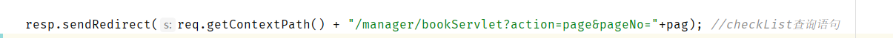

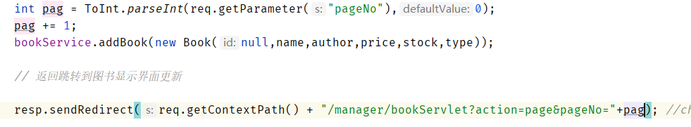

BookServlet中的page方法防止浏览输入栏中的地址pageNo越界

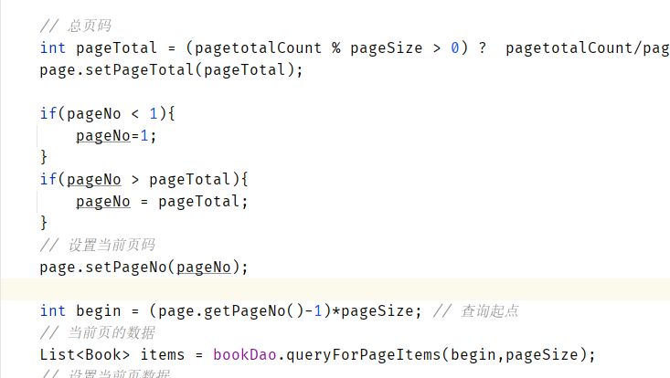

删除图书

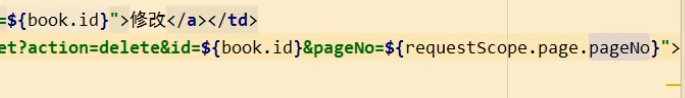

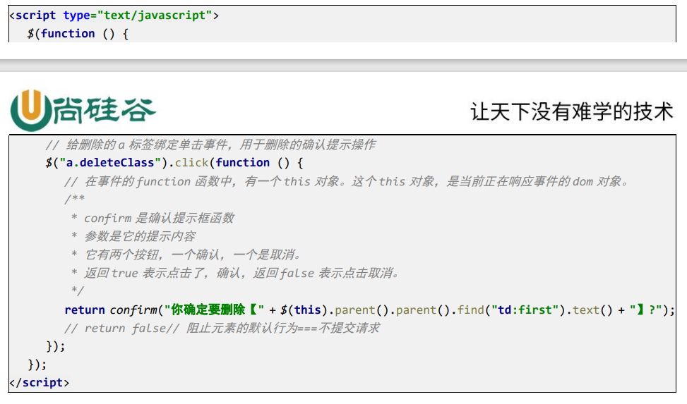

BookServlet

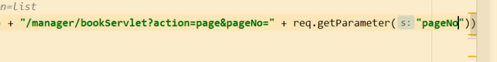

修改

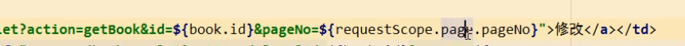

## 前台分页

http://ip:port/工程路径/和http://ip:port/工程路径/indexjsp都是在访问web目录下的index.jsp

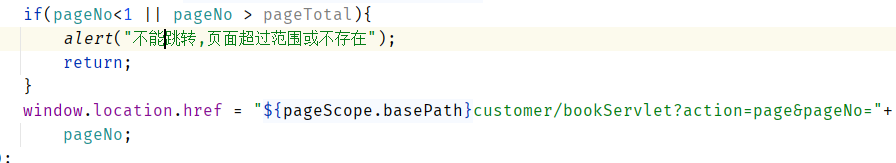

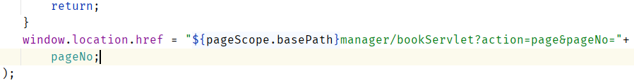

page中的url为manager/bookServlet?action=page

customer/bookServlet?action=page

## 价格区间查询

### BookInfo.jsp

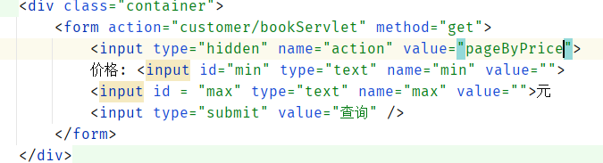

### CustomerBookServlet.java中的pageByPrice方法

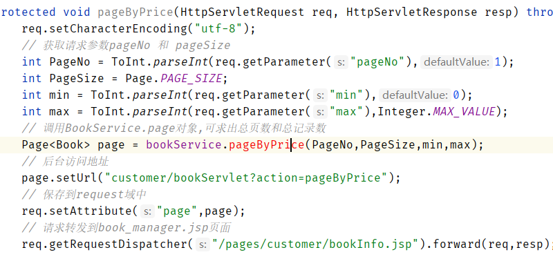

### 分页条中不带价格区间的bug  ---- StringBuilder是可变字符串,String类型是不可变的类型

如果min和max有值的话就获取并接到可变长字符串的末尾记录url地址页面，避免<mark>跳转到查询所有图书信息</mark>的页面。

由于查询价格时还加了按照价格排序，**所以如果当min和max都没有值的时候，可以设置sql语句为默认的不排序的分页模式(按照id)。**

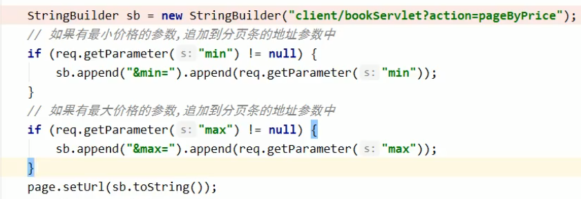

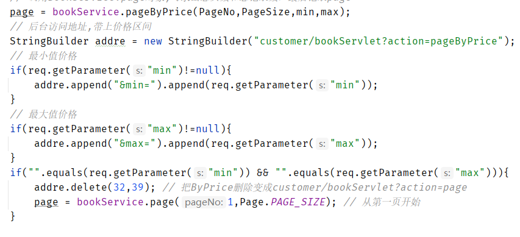

但是我们只能改变Page对象，重新获取一个新的Page对象，因为价格查询是靠另外一个函数获取的，且这个函数带有min和max两个参数，所以要调用另外一个函数来获取Page。

### 价格区间回显

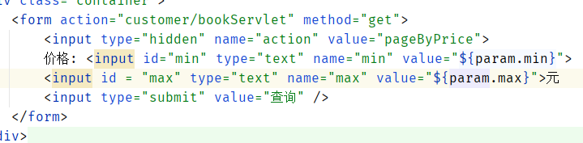

求价格区间内的总记录数的时候要把int型转换成String类型，拼接sql语句。

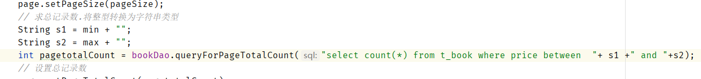

登录用户回显信息

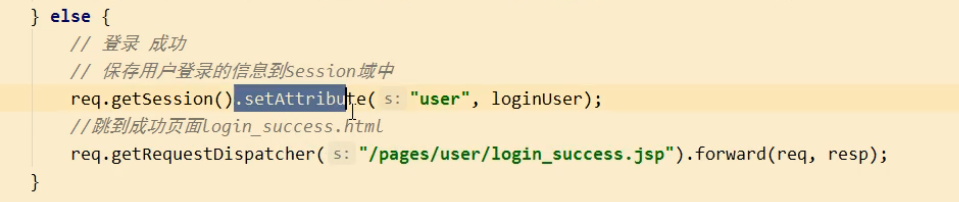

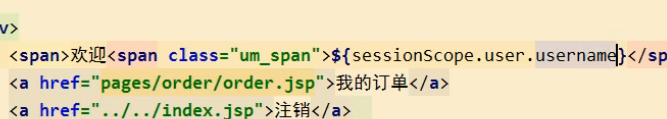

点击购买书籍就执行添加到数据库操作就行了，点击购买时获取这本

book的id，和user的username，

select bookNum from  t_order where username=? and bookId = ?;

**订单数据库表**

username用户名

书的id(唯一)bookId

数量 bookNum

**订单对象**

username用户名

书的id(唯一)bookId

书的名字

书的类型 bookType

数量 bookNum

订单Dao 和 Service

Dao：1、负责查询该用户是否有这本书(id)，如果有返回这个订单对象Order。没有返回null

​	2、根据bookId更新书籍数量的方法

Service负责调用Dao中的查询方法，如果有这个id，数量加1，再更新这个订单记录中该书的数量即可。

查看我的书架即可显示自己已买的书

