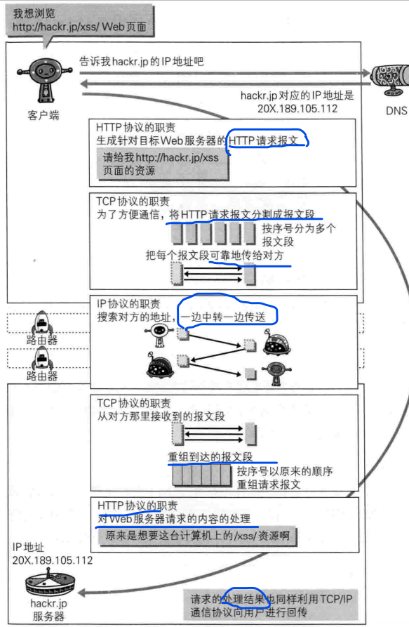
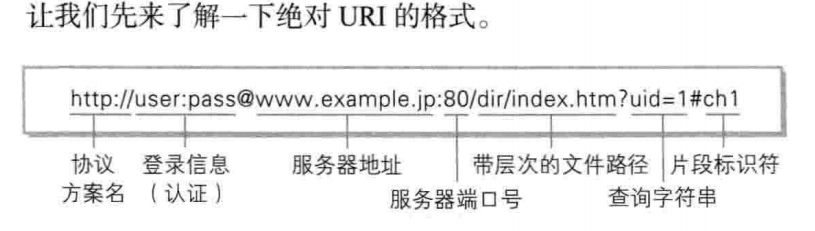
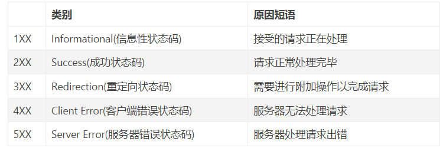
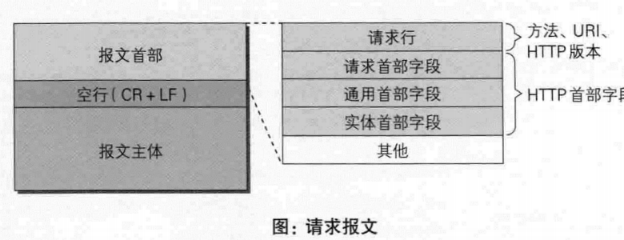
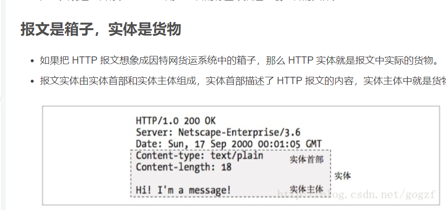
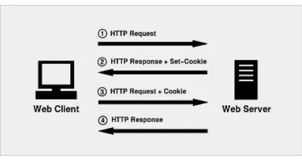
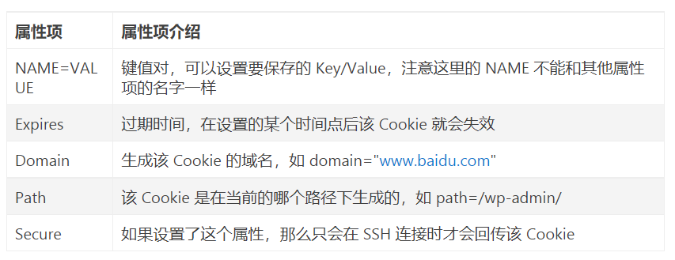

# 图解HTTP知识点

## HTTP协议和IP、DNS、TCP协议之间的联系

通常使用的网络是在TCP/IP协议族基础上运作的，而HTTP属于它内部的一个子集。

HTTP和DNS、FTP一样是应用层的协议。

- URI(统一资源标识符),URI用字符串标识某一互联网资源，
- URL(统一资源定位符)，表示资源的地点(互联网上所处的位置)

<mark>常遇到的状态码及说明</mark>

<table style="width: 701px" border="1">
<tbody>
<tr><th height="34">状态码</th><th height="34">状态描述</th><th height="34">简要说明</th></tr>
<tr>
<td align="center" valign="middle" width="202">200</td>
<td align="center" valign="middle" width="238">OK</td>
<td align="left" valign="top" width="218">客户端请求成功</td>
</tr>
<tr>
<td align="center" valign="middle" width="216">201</td>
<td align="center" valign="middle" width="247">Created&nbsp;</td>
<td align="left" valign="top" width="225">请求已经被实现，而且有一个新的资源已经依据请求的需要而创建，且其URI已经随Location头信息返回。</td>
</tr>
<tr>
<td align="center" valign="middle" width="220">301</td>
<td align="center" valign="middle" width="248">Moved Permanently</td>
<td valign="top" width="228">被请求的资源已永久移动到新位置，并且将来任何对此资源的引用都应该使用本响应返回的若干个URI之一</td>
</tr>
<tr>
<td align="center" valign="middle" width="222">302</td>
<td align="center" valign="middle" width="247">Found</td>
<td valign="top" width="230">在响应报文中使用首部“Location: URL”指定临时资源位置</td>
</tr>
<tr>
<td align="center" valign="middle" width="222">304</td>
<td align="center" valign="middle" width="247">Not Modified</td>
<td valign="top" width="231">条件式请求中使用</td>
</tr>
<tr>
<td rowspan="1" colspan="1" align="center" valign="middle" width="222">403</td>
<td rowspan="1" colspan="1" align="center" valign="top" width="222">Forbidden</td>
<td rowspan="1" colspan="1" align="center" valign="top" width="222">请求被服务器拒绝</td>
</tr>
<tr>
<td rowspan="1" colspan="1" align="center" valign="middle" width="222">404</td>
<td rowspan="1" colspan="1" align="center" valign="top" width="222">Not Found</td>
<td rowspan="1" colspan="1" align="center" valign="top" width="222">服务器无法找到请求的URL</td>
</tr>
<tr>
<td rowspan="1" colspan="1" align="center" valign="middle" width="222">405</td>
<td rowspan="1" colspan="1" align="center" valign="top" width="222">Method Not Allowed</td>
<td rowspan="1" colspan="1" align="center" valign="top" width="222">不允许使用此方法请求相应的URL</td>
</tr>
<tr>
<td rowspan="1" colspan="1" align="center" valign="middle" width="222">500</td>
<td rowspan="1" colspan="1" align="center" valign="top" width="222">Internal Server Error</td>
<td rowspan="1" colspan="1" align="center" valign="top" width="222">服务器内部错误</td>
</tr>
<tr>
<td rowspan="1" colspan="1" align="center" valign="middle" width="222">502</td>
<td rowspan="1" colspan="1" align="center" valign="middle" width="222">Bad Gateway</td>
<td rowspan="1" colspan="1" align="center" valign="top" width="222">代理服务器从上游收到了一条伪响应</td>
</tr>
<tr>
<td rowspan="1" colspan="1" align="center" valign="middle" width="222">503</td>
<td rowspan="1" colspan="1" align="center" valign="middle" width="222">Service Unavailable</td>
<td rowspan="1" colspan="1" align="center" valign="top" width="222">服务器此时无法提供服务，但将来可能可用</td>
</tr>
<tr>
<td rowspan="1" colspan="1" align="center" valign="middle" width="222">505</td>
<td rowspan="1" colspan="1" align="center" valign="middle" width="222">HTTP Version Not Supported</td>
<td rowspan="1" colspan="1" align="center" valign="top" width="222">服务器不支持，或者拒绝支持在请求中使用的HTTP版本。这暗示着服务器不能或不愿使用与客户端相同的版本。响应中应当包含一个描述了为何版本不被支持以及服务器支持哪些协议的实体。</td>
</tr>
</tbody>
</table>

## HTTP状态码

## 报文主体和实体主体的差异

- Http报文结构

- 报文

是HTTP通信中的基本单位，由8位组字节流组成，通过HTTP通信传输。

- 实体

作为请求或响应的有效在载荷数据被传输，其内容由<mark>实体首部和实体主体</mark>组成。

## Cookie

### 1、什么是cookie，cookie的作用？

HTTP协议本身是无状态的，即服务器无法判断用户的身份。Cooike实际上是一小段的文本信息(key-value格式)。客户端向服务器发送请求，如果服务器需要记录该用户的状态，就需要在<mark>响应中向客户端浏览器颁发一个Cookie</mark>。客户端浏览器会<mark>保存Cookie</mark>。

当浏览器再请求该网站时，浏览器把<mark>请求的网址和该Cookie</mark>一起提交给服务器。服务器检查该Cookie以此辨认用户状态。

### 2、cookie机制

当用户第一次访问并登录一个网站时，cookie的设置以及发送经历以下步骤：

- 客户端发送一个请求到服务器
- 服务器发送一个HttpResponse响应到客户端，其中包含Set-Cookie的头部
- 客户端保存cookie，之后再次向服务器发送请求时，HttpRequest请求中会包含一个Cookie的头部
- 服务器返回响应数据

### 3、cookie属性项

<mark>深入理解cookiehttps://www.jianshu.com/p/6fc9cea6daa2</mark>

修改或删除cookie

HttpServletResponse提供的Cookie操作只有一个addCookie(Cookie cookie)，所以想要修改Cookie只能使用一个同名的Cookie来覆盖原先的Cookie。如果要删除某个Cookie，则只需要新建一个同名的Cookie，并将maxAge设置为0，并覆盖原来的Cookie即可。

新建的Cookie，除了value、maxAge之外的属性，比如name、path、domain都必须与原来的一致才能达到修改或者删除的效果。否则，浏览器将视为两个不同的Cookie不予覆盖。

值得注意的是，从客户端读取Cookie时，包括maxAge在内的其他属性都是不可读的，也不会被提交。浏览器提交Cookie时只会提交name和value属性，maxAge属性只被浏览器用来判断Cookie是否过期，而不能用服务端来判断。

**我们无法在服务端通过cookie.getMaxAge()来判断该cookie是否过期，maxAge只是一个只读属性，值永远为-1。当cookie过期时，浏览器在与后台交互时会自动筛选过期cookie，过期了的cookie就不会被携带了。**

