# 云计算实训

## Linux基础

快捷键操作

ctrl + c  //结束命令

ctrl + l  //清屏

tab    //自动补全命令、文件或者目录的路径

### Linux目录结构

​     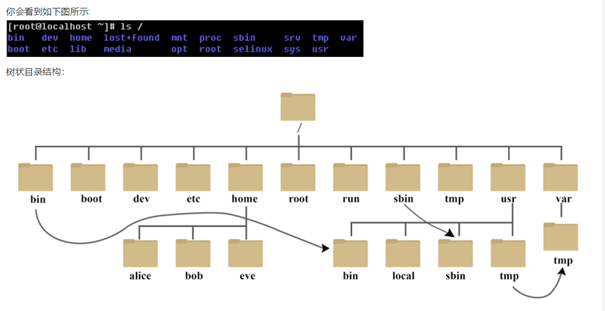

\# cd      //切换目录

\# pwd      //打印当前所在目录

 

### Linux 文件管理

### 文件的增删改查

增

\# touch a.txt    //创建文件a.txt

删

\# rm -rf 文件名称

-r  删除目录

-f  forece 强制

改

\# mv 移动和改名

\# cp 复制

cp -r 复制目录

cp -p 复制后目标文件保留源文件的属性

查

\# cat  查看文件的所有内容 -n //打印行号

\# head 默认查看文件的前10行 -5 //查看前5行

\# tail 默认查看文件的后10行

### 目录的增删改查

增

\# mkdir 创建目录

-p  //创建联级目录

 

查

\# ls

-l  //查看长格式 全部信息

-a  //查看隐藏文件

-d  //配合-l使用，查看目录本身详细信息

\# tree  //查看目录结构 (yum install tree -y 安装该命令)

 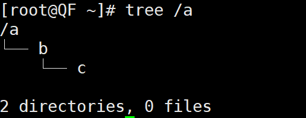

### VIM的使用

 

### 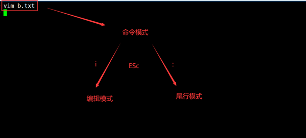命命令模式

#### 控制光标

​	gg 控制光标到第一行的行首

​	G  控制光标到最后一行的行首

​	5gg 控制光标到第5行的行首

#### 文件行处理

​	dd 删除光标所在位置的行，5dd 删除5行

​	yy 复制光标所在的行，5yy 复制5行

​	p  粘贴

​	dG 删除光标一行的所有行(包括光标所在的行)

​	dY 复制光标一行的所有行(包括光标所在的行)

 

#### 高亮模式：快速找到关键字

/root //高亮文件root的关键字，按n可以往下翻

### 编辑模式--按i进入

i 在光标的前面进入插入

a 在光标的后一个字符前面进行插入

o 另起一行进行插入

### 尾行模式-退出、替换字符

:wq 保存退出

:q  不保存退出

(加上! 代表强制)

:1,$ s/root/ROOT/g   //把第一行到最后一行中所有的root替换为ROOT

:set number   //加上行号

 

dd：剪切当前行

 4 ndd：n表示大于1的数字，剪切n行

 5 dw：从光标处剪切至一个单子/单词的末尾，包括空格

 6 de：从光标处剪切至一个单子/单词的末尾，不包括空格

 7 d$：从当前光标剪切到行末

 8 d0：从当前光标位置（不包括光标位置）剪切之行首

 9 d3l：从光标位置（包括光标位置）向右剪切3个字符

10 d5G：将当前行（包括当前行）至第5行（不包括它）剪切

11 d3B：从当前光标位置（不包括光标位置）反向剪切3个单词

12 dH：剪切从当前行至所显示屏幕顶行的全部行

13 dM：剪切从当前行至命令M所指定行的全部行

14 dL：剪切从当前行至所显示屏幕底的全部行

 

 

 

 

 

 

 

 

 

# 9.6_基于LAMP架构上线qqfarm

基础服务： ftp DNS ssh

web服务： apache nginx tomcat

数据库服务：mysql redis 

中间件服务：php mycat

 

### LAMP架构

Linux + APache + MySQL + PHP

 

环境：Linux 发行版centos 7.6 64位

 

### Apache服务

\# yum install httpd -y

\# systemctl start httpd 

 

/var/www/html ---- 默认网页存放目录

 

### 方法1：官方yum 安装方法

MySQL服务：

### 1、下载安装mysql的yum源repo文件的rpm包

\# wget https://dev.mysql.com/get/mysql80-community-release-el7-3.noarch.rpm

 

### 2、安装

\# rpm -ivh mysql80-community-release-el7-3.noarch.rpm

 

### 3、验证是否安装

\# ls /etc/yum.repos.d/ //观察是否有mysql-community.repo

 

### 4、修改源文件，修改安装的版本

\# vim /etc/yum.repos.d/mysql-community.repo

(按i进行修改)

21行的enabled=0 改为 =1

28行的enabled=1 改为 =0

 

### 5、测试

\# yum repolist //观察是否有mysql57-community 的关键字样

 

### 6、安装mysql

\# yum install mysql-community-server -y

 

### 方法2：采用本地安装

1、用rz命令把mysql_package.zip 上传到服务器上

2、解压

\# unzip mysql_package.zip

\# cd package/

\# yum localinstall * -y //一定要切换到package目录

 

****修改mysql的初始密码*****

\# systemctl start mysqld //启动mysql服务

\# grep password /var/log/mysqld.log // : 后面的字符串，都是mysql的初始密码

\# mysqladmin -uroot -p'初始密码' password '新密码' //建议新密码设置为Qf..2021

\# mysql -uroot -p'Qf..2021' //进行测试登入

 

### PHP服务：

\# yum install php php-mysql -y


修改apache配置文件，配置php跟apache联动

\# vim /etc/httpd/conf/httpd.conf

//在指定位置添加上index.php

 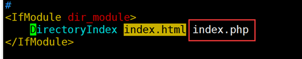

\# systemctl restart httpd //改了配置文件一定记得重启服务

### 测试apache是否能跟php联动

\# vim /var/www/html/index.php

 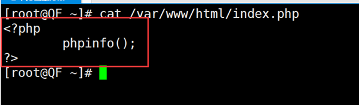

### 最后浏览器访问测试

 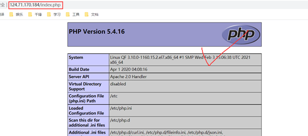

### 项目上线环节：

\# rz  //压缩包

\# unzip // 解压压缩包

\# cp -r upload/ /var/www/html/

 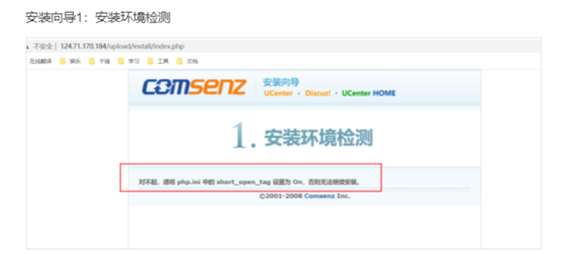

#### 解决：

 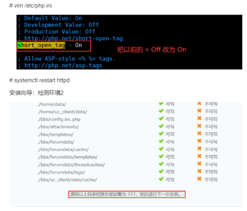

\# chmod 777 -R /var/www/html/upload/ucenter

\# chmod 777 -R /var/www/html/upload/bbs/

\# chmod 777 -R /var/www/html/upload/home/

 

#### 安装向导：检测环境3

修改数据库连接

\# mysql -uroot -p'Qf..2021' //登入到数据库

mysql> create database farm; //创建数据库

mysql> grant all on farm.* to farm@localhost identified by 'Qf..2021';

//授权farm用户使用Qf..2021单独管理farm数据库

\# mysql -ufarm -p'Qf..2021' -D farm < /var/www/html/upload/qqfarm.sql

//导入数据库文件

 

 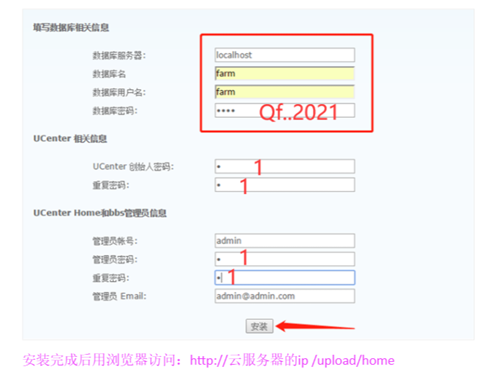

 

 

 

 

 

 

 

 

 

 

 

 

 

 

# 9.7_Nginx

# 1.  Nginx安装

 

 

### 1、 下载nginx源码包

 ` \# wget http://nginx.org/download/nginx-1.20.1.tar.gz`

### 2、 安装nginx

```nginx
# tar xf nginx-1.20.1.tar.gz

# cd nginx-1.20.1/

# yum install pcre-devel openssl-devel -y

//安装编译环境所需要的依赖

# ./configure --prefix=/usr/local/nginx --sbin-path=/sbin/nginx --user=nginx --group=nginx --with-http_stub_status_module --with-http_ssl_module

 

# make && make install 
```

​                 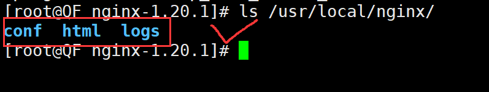        


 //安装结束后如果有这三个目录代表安装成功

 

### 3、启动Nginx

 ```ngin
 # useradd -s /sbin/nologin -M nginx
 //创建nginx用户管理nginx的进程
 # systemctl stop httpd 
 //防止80端口冲突，先暂时将apache服务关闭
 # nginx   //启动
 # nginx -v   //查看版本
 # nginx -V   //查看编译选项
 # nginx -t   //检查配置文件语法
 # nginx -s stop     //停止服务
 # nginx -s reload   //平滑重启  
  
 
 
 nginx的配置文件详解：
 nginx主配置文件主要有以下几大块
     1、全局块：配置影响nginx全局的指令。一般有运行nginx服务器的用户组，nginx进程pid存放路径，日志存放路径，配置文件引入，允许生成worker process数等。
     2、events块：配置影响nginx服务器或与用户的网络连接。有每个进程的最大连接数，选取哪种事件驱动模型处理连接请求，是否允许同时接受多个网路连接，开启多个网络连接序列化等。epoll
     3、http块：可以嵌套多个server，配置代理，缓存，日志定义等绝大多数功能和第三方模块的配置。如文件引入，mime-type定义，日志自定义，是否使用sendfile传输文件，连接超时时间，单连接请求数等。
     4、server块：配置虚拟主机的相关参数，一个http中可以有多个server。
     5、location块：配置请求的路由，以及各种页面的处理情况。
 
 ```


### 4、状态访问


 ```nginx
 状态访问统计:
 # vim /usr/local/nginx/conf/nginx.conf
 在server中添加如下行
               location = /status {
                  stub_status on;
                  access_log off;
                }
 查看访问状态统计:
 浏览器:http://公网IP地址/status 刷新可得到如下变化结果
 Active connections: 5  
 server accepts handled requests  
 32 32 7  
 Reading: 0 Writing: 1 Waiting: 4 
 
 ```

​                 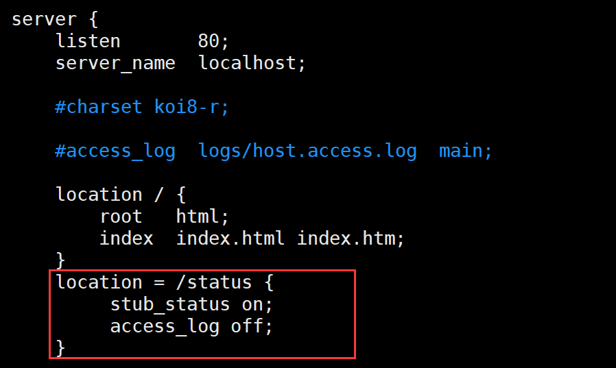        


### 5、nginx目录结构

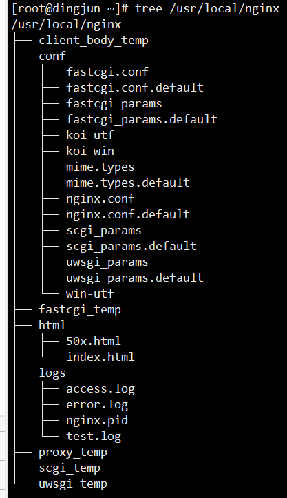


### 6、访问控制

```java
访问控制:
有时我们会有这么一种需求,就是你的网站并不想提供一个公共的访问或者某些页面不希望公开,我们希望的是某些特定的客户端可以访问.
那么我们可以在访问时要求进行身份认证,就如给你自己的家门加一把锁,以拒绝那些不速之客.
我们在服务课程中学习过apache的访问控制,对于Nginx来说同样可以实现,并且整个过程和Apache 非常的相似.
用户认证:
    location / {
                root   html; 
                index  index.html index.htm;
                auth_basic "haha";           #服务器描述信息
                auth_basic_user_file  /usr/local/nginx/passwd.db;     #存放用户名和密码的文件
            }

    [root@web html]# htpasswd -c /usr/local/nginx/passwd.db user1
    New password: 
    Re-type new password: 
    Adding password for user user1

访问控制:      deny/allow顺序:从上到下
    location / {
                root   html;
                index  index.html index.htm;
                allow   192.168.10.0/24;
                deny    all;
            }
            
apache:            
            order allow,deny
            allow from 192.168.10.0/24
            deny from all
 
限速:
使用limit_rate指令
Syntax:   limit_rate rate;
Default:  limit_rate 0;
Context: http, server, location, if in location

```


----


# 9.9JDK+tomcat上线jspgou

\# rz         //jspgou.zip压缩包

\# du -h jspgou.zip          //为了防止上传压缩包有问题，检查大小

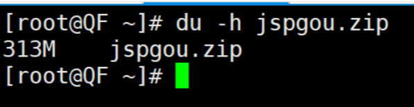

\# unzip jspgou.zip

​                 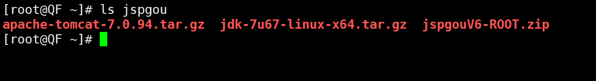      

**第三个是一个java项目**


### 安装 JDK环境

```java
# vim /etc/profile  是配置linux相关命令的文件
# vim /etc/profile.d/java.sh	脚本

// 定义环境变量
#!/bin/bash  不是注释的意思，表示后面所有的命令都是来自bin目录里面的
JAVA_HOME=/usr/local/jdk1.7  
PATH=$JAVA_HOME/bin:$PATH	
export JAVA_HOME PATH


# source /etc/profile.d/java.sh        //执行，触发

```


验证java环境

```java
# java -version
```

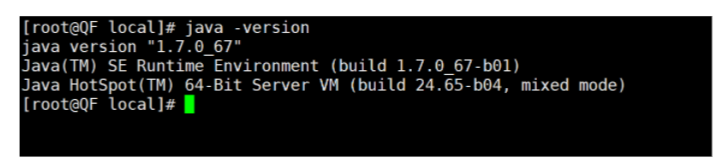


### 2、配置tomcat

```java
# tar xf jspgou/apache-tomcat-7.0.94.tar.gz -C /usr/local/
# mv /usr/local/apache-tomcat-7.0.94/ /usr/local/tomcat7.0

```

启动tomcat

```java
# /usr/local/tomcat7.0/bin/startup.sh        //启动tomcat
# /usr/local/tomcat7.0/bin/shutdown.sh       //关闭tomcat
# netstat -tnlp          //观察是否有8080端口

```

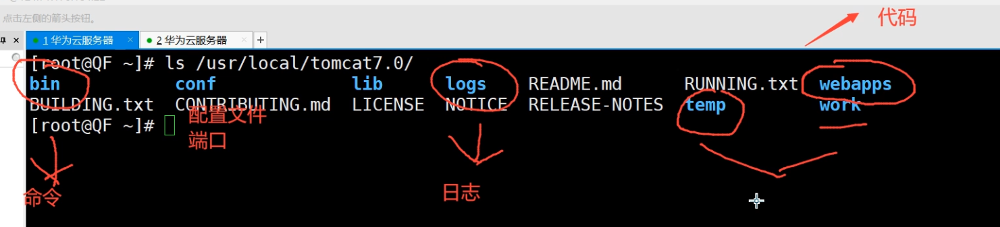


### 3、上线JSPGOU项目

```java
# unzip jspgou/jspgouV6-ROOT.zip 
//会在当前目录解压出DB  ROOT的两个目录
# rm -rf /usr/local/tomcat7.0/webapps/ROOT/
# cp -r ROOT/ /usr/local/tomcat7.0/webapps/

```

数据库操作：

```java
# mysql -uroot -p'Qf..2021'
mysql> create database jspgou default charset=utf8;
```

导入数据库文件

```java
可能遇到的问题： 
[root@host1 webapps]# mysql -uroot -p'Qf..2021' -D jspgou < /root/DB/jspgou.sql  
mysql: [Warning] Using a password on the command line interface can be  insecure. 
ERROR 1067 (42000) at line 97: Invalid default value for 'api_call_time' 
解决方案： 
解决： 在mysql安装目录下找见/etc/my.cnf 
[mysqld] 下面添加 sql_mode=STRICT_TRANS_TABLES,ERROR_FOR_DIVISION_BY_ZERO,NO_AUTO_CREATE_USER,NO_ENGINE_SUBSTITUTION explicit_defaults_for_timestamp=1 // (注意这是新的一行)
重启mysqld服务重新导入 
# systemctl restart mysqld

```


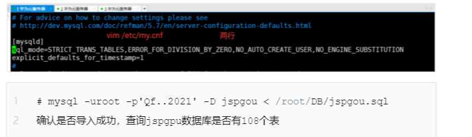


**修改JSPGOU目录连接数据库**

```java
程序包内
# vim /usr/local/tomcat/webapps/ROOT/WEB-INF/config/jdbc.properties
文件第20行左右 
jdbc.url=jdbc:mysql://127.0.0.1:3306/创建好的数据库名?characterEncoding=UTF-8 
jdbc.username=root 
jdbc.password=Qf..2021 

```

sudo chmod -R 777 某一目录   	// 修改目录访问权限


**重启tomcat服务**

```java
# /usr/local/tomcat7.0/bin/shutdown.sh       //关闭tomcat

# /usr/local/tomcat7.0/bin/startup.sh        //启动tomcat

```


**访问网页(使用:8080)**

`ip:8080`访问网页


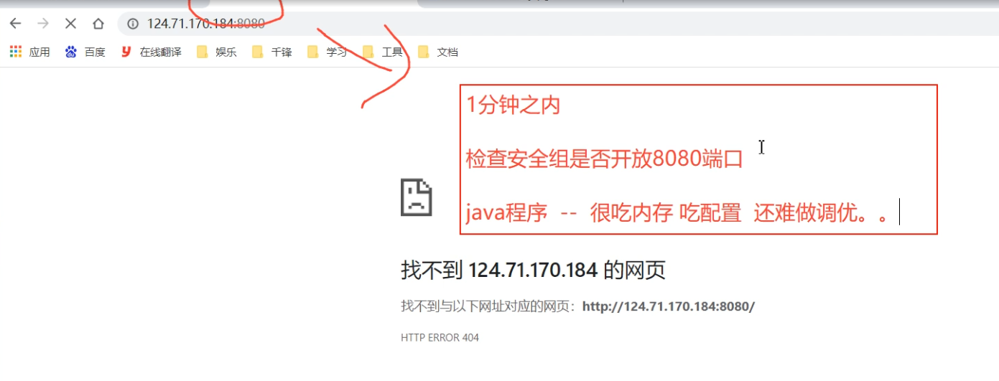

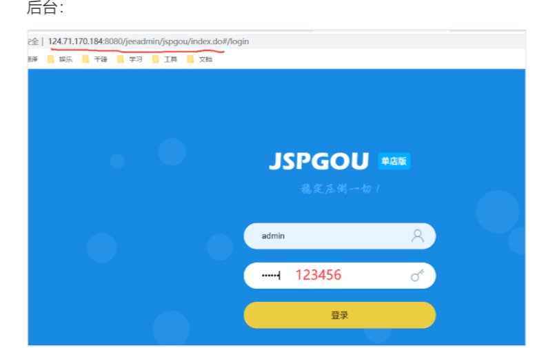

