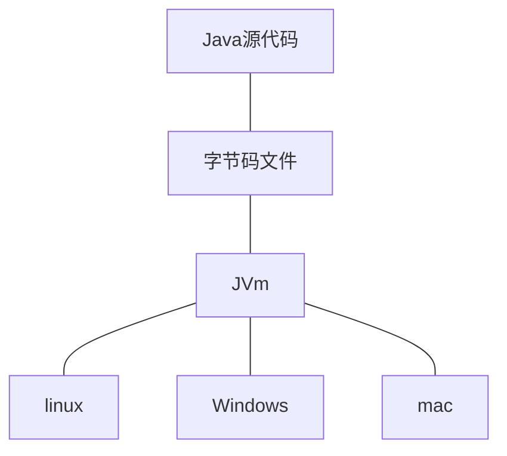

### JDK简介

`java Development TookKit`(java开发工具包)，是整个Java

的核心，包括了java运行环境(JRE),java工具(javac/java/jdb)和java基础的类库(即Java API)

### JRE简介

JRE是 java 运行环境，并不是一个开发环境，所以没有包含任何开发工具(如编译器和调试器),只是针对于使用java程序的用户

​     JRE(Java Runtime Enviroment,java 运行环境)，包含JVM 标准实现及核心类库。 JRE 中包含了 `Java virtual machine(JVM)` `runtime class libraries`和`Java application launcher`，这些是运行java 程序的必要组件，通过它，java 的开发者才得以将自己开发的程序发布到用户手中。

### JVM简介

`Java Virtual Machine`（java虚拟机），

JVM 是 JRE 的一部分，它是整个java实现跨平台的最核心部分，负责解释执行字节码文件，是可运行java字节码文件的虚拟计算机。

所有平台的 JVM 向编译器提供相同的接口 ，而编译器只需要面向虚拟机，生成虚拟机能识别的代码，然后由虚拟机来解释执行

当使用java编译器编译java程序时，生成的是与平台无关的字节码，这些字节码只面向JVM。不同平台的JVM都是不同的，但是它们都提供相同的接口 

### JVM和JRE的区别

|          | JDK                             | JRE              |
| -------- | ------------------------------- | ---------------- |
| 地位     | 开发环境                        | 运行环境         |
| 面向对象 | 开发人员                        | 程序使用者       |
| 主要作用 | 可运行java程序，也可从事开发    | 只能运行java程序 |
| 组成     | JRE+java的开发工具+java基础类库 | JVM+Java核心类库 |

### JAVA跨平台原理

当使用Java编译器编译Java程序时，生成的是与平台无关的字节码，这些字节码只面向JVM。不同平台的JVM都是不同的，但它们都提供了相同的接口。JVM是Java程序跨平台的关键部分，只要为不同平台实现了==相应的虚拟机==，编译后的Java字节码就可以在该平台上运行。

