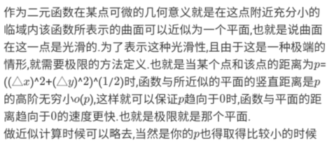
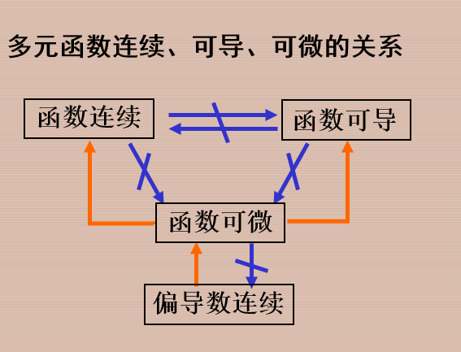
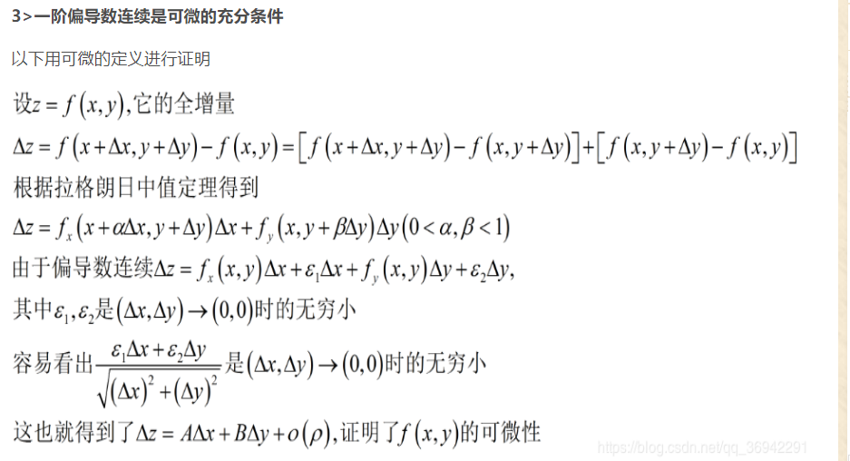

# 全微分的定义

由一元函数微分学中的增量与微分的关系得

$f(x+\Delta x,y)-f(x,y)\approx f_x(x,y)\Delta x$

$f(x,y+ \Delta y)-f(x,y) \approx f_y(x,y)\Delta y$

二元函数对 x和对 y的偏移量

# 全增量

函数$z=f(x,y)$在点的某领域内有定义，并设$p'(x+\Delta x,y+\Delta y)$ 为这领域内任意一点，则称这两点的函数值之差

$f(x+\Delta,y+\Delta y)-f(x,y)$为函数在点P对应于自变量增量$\Delta x,\Delta y$的全增量，记作$\Delta z$, 

$\Delta z=f(x+\Delta x,y+\Delta y)-f(x,y)$

$\Delta z=A \Delta x+B \Delta y+o(\rho), \quad \lim _{\rho \rightarrow 0} \Delta z=0$

# 定义

如果函数$z=f(x,y)$在点$(x,y)$的全增量$\Delta=f(x+\Delta x,y+_\Delta y)-f(x,y)$ 可以表示为 $\Delta z=A \Delta x+B\Delta y+o(\rho)$  其中$A,B$ 仅与$x,y$有关

$\rho=\sqrt{{(\Delta x)^2}+{\Delta y}^2}$,则称函数$z=f(x,y)$在点$(x,y)$可微分，

$A\Delta x+B\Delta y$称为函数在点$(x,y)$的==全微分==，即为$dz$,

即$dz=A\Delta x+B\Delta y$

## 定理一（必要条件）

==如果函数$z=f(x,y)$ 在点$(x,y)$ 可微分，则该函数在点$(x,y)$的偏导数$\frac{\partial z}{\partial x}  ,\frac{\partial z}{\partial y}$必存在==

且全微分为

  $dz=\frac{\partial z}{\partial x}\Delta x+\frac{\partial z}{\partial y}\Delta y$    

==一阶偏导数连续时可微的充分条件==

一元函数在某点的导数存在 $\Longrightarrow$  微分存在

多元函数的各偏导数存在 $\frac{\nrightarrow}{\leftarrow}$ 全微分存在

##  定理二（充分条件）

如果函数$z=f(x,y)$的偏导数$\frac{\partial z}{\partial x},\frac{\partial z}{\partial y}$在点$(x,y)$连续，则该函数在点$(x,y)$可微分

习惯上记全微分为$d z=\frac{\partial z}{\partial x} d x+\frac{\partial z}{\partial y} d y$

# 多元函数连续、可导、可微的关系

## 多元函数可导、可微、连续、一阶偏导数连续之间关系

1>可导不一定连续，连续不一定可导

对于二元函数而言，==可导是指两个偏导数存在==，偏导数是把某一自变量看作一个常数时的导数。偏导数的存在只能保证与==坐标轴平行的方向==上==函数的极限值等于函数值==；

但是==连续是指函数以任何方式趋近于某一定点==，二元函数本身是平面型的，趋于某一定点是从四面八方的，而平行于坐标轴仅仅是其中一种情况，所以==可导不一定连续==，同时==可导也不能保证函数在这一点有极限==

至于连续不一定可导可以借鉴一元函数

2>可微必连续，可微必可导，反之不成立

可微性质最强，若二元函数在某一点可微，==说明过该点任意垂直XY平面的切平面与该二元平面的交线函数在该点连续且在该点的导函数存在==，全微分是二元函数所以性质的综合，但是，连续与偏导数存在仅仅是可微的部分条件

可微的充分条件是可导(两个偏导数)且导数连续 (上面图片证明)

