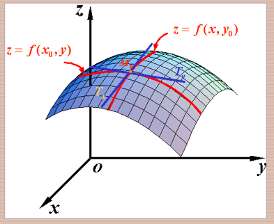

# 多元函数

###  定义 :$f(D)=\{z | z=f(x, y),(x, y) \in D\}$

函数值$f(x,y)$ 的全体所构成的集合称为函数$f$  的值域,记作$f(D)$.

 类似的可定义三元函数$u=f(x,y,z),(x,y,z)\in D$  以及三元以上的函数

$u=f(x_1,x_2,\cdots ,x_n),(x_1,x_2,\cdots,x_n)\in D$  

$u=f(x),x=(x_1,x_2,\cdots,x_n)\in D$

也记作 $u=f(p),p(x_1,x_2,\cdots,x_n)\in D$

当n=1 时，n元函数就是一元函数，当$n\geq 2$ 时，就为多元函数

## 多元函数的极限

设二元函数$f(p)=f(x,y)$的定义域为D，$P_0(x_0,y_0)$ 是其聚点

存在常数   A

对于任意给定的正数     $\epsilon $ 

总存在  $\delta$   

使得当点 $$p(x, y) \in D \cap \stackrel{0}{U}\left(p_{0}, \delta\right)$$

都有$|f(p)-A|=|f(x,y)-A|<\epsilon$  成立

那么称常数A 为函数$f(x,y)$ 当$(x,y)-->(x_0,y_0)$时的极限

记作  

$\lim _{(x, y) \rightarrow\left(x_{0}, y_{0}\right)} f(x, y)=A$

二元函数的极限叫做==二重极限==

注意：：二重极限存在，是指$P(x,y)$以==任何方式==趋于$p_0(x_0,y_0)$时，$f(x,y)$都无限接近于 A

## 多元函数的连续性

定义3

设二元函数$f(p)=f(x,y)$的定义域为$D$,$p_0(x_0,y_0)$为D的聚点，且$p_0\in D$ 

如果$\lim _{(x, y) \rightarrow\left(x_{0}, y_{0}\right)} f(x, y)=f\left(x_{0}, y_{0}\right)$

则称函数在点$p_0(x_0,y_0)$连续

如果函数在 D 的每一点都连续，那么就称函数$f(x,y)$在D上连续，或者称$f(x,y)$时D

上的连续函数

## 多元初等函数

由多元多项式及基本初等函数经过有限次的四则运算和复合步骤所构成的可用一个式子所表示的多元函数

**一切多元初等函数在其定义域内是连续的**

# 偏导数

## 定义和算法

定义：设函数$z=f(x,y)$在点$(x_0,y_0)$的某一领域内有定义，当$y$  固定在$y_0$ 而 $x$ 在 $x_0$ 处有增量$\Delta x$  

---

$\Delta  z=f(x_0+\Delta x)-f(x_0,y_0)$  如果$\Delta z$与$\Delta x$ 之比当$\Delta x->0$ 时极限存在，

那么此极限值为函数$z=f(x,y)$在$(x_0,y_0)$处对x 的偏导数，记作$f'_X(x_0,y_0)$ 

函数$z=f(x,y)$在$(x_0,y_0)$处对x 的偏导数，实际上就是把 $y$固定 在$y_0$ 看成常数后，一元函数$z=f(x,y_0)$在$x_0$ 处的导数.

 

---

相应函数有增量 $f\left(x_{0}+\Delta x, y_{0}\right)-f\left(x_{0}, y_{0}\right)$

如果$\lim _{\Delta x \rightarrow 0} \frac{f\left(x_{0}+\Delta x, y_{0}\right)-f\left(x_{0}, y_{0}\right)}{\Delta x}$存在

则称此极限为函数$z=f(x,y)$在点$(x_0,y_9)$处对x的偏导数，即为

$\left.\frac{\partial z}{\partial x}\right|_{{y=y_0}{x=x_0}}$      $\left.\frac{\partial f}{\partial x}\right|_{{y=y_0}{ x=x_0}}$

$z_x|_{{x=x_0}{y=y_0}} $       或  $f_x(x_0,y_0)$    

对y的偏导数 为 

$\lim _{\Delta_{y} \rightarrow 0} \frac{f\left(x_{0}, y_{0}+\Delta y\right)-f\left(x_{0}, y_{0}\right)}{\Delta y}$

即为   

 $\left.\frac{\partial z}{\partial y}\right|_{x=x_{0}},\left.\frac{\partial f}{\partial y}\right|_{{x=x_0}{y=y_0}}$  

$z_y | \begin{array}{l}x=x_{0} \\ y=y_{0}\end{array}$               或        $f_{y}\left(x_{0}, y_{0}\right)$

如果函数$z=f(x,y)$在区域 D内任一点$(x,y)$处对  x  的偏导数都存在，那么这个偏导数就是 x,y 的函数，它就称为函数$z=f(x,y)$对自变量 x 的偏导数，记作 

$\frac{\partial z}{\partial x}, \frac{\partial f}{\partial x}$

$z_{x}$                $f_{x}(x, y)$

 

$z=f(x,y)$对自变量$y$的偏导数，记作

$\frac{\partial z}{\partial y}, \frac{\partial f}{\partial y}$

$z_y$或 $f_y(x,y)$  

求导的方法：

求 $\frac {\partial z}{\partial x}$时，把 y 暂时看作常量对 x 求导

求 $\frac {\partial z}{\partial y}$时，把 x 看作常量对 y求导

### 偏导数的几何意义

设$M_0(x_0,y_0,f(x_0,y_0))为曲面$$z=f(x,y)$上的一点

偏导数$f_x(x_0,y_0)$就是曲面被平面$y=y_0$所截得得曲线在点 $M_0$ 处的切线对 $x$轴的斜率

偏导数$f_y(x_0,y_0)$就是曲面被平面$x=x_0$所截的曲线在点  $M_0$ 处的切线对 $y$ 轴的斜率

一元函数在某点可导------------------->>连续

多元函数中 在某点偏导数存在 $\neq$  连续

#### 偏导数连续

先用定义求出该点的偏导数$c$  ,再用求导公式求出不在该点时的偏导数$f_x(x,y)$,最后求$(x,y)$趋于该点时的极限，如果$\lim f_x(x,y)=c$，即偏导数连续，否则不连续

## 高阶偏导数

函数$z=f(x,y)$的二阶偏导数为

$\frac{\partial }{\partial x}(\frac{\partial z}{\partial x})=\frac{\partial^2 z}{\partial x^2}=f_{xx}(x,y)$     纯偏导

$\frac{\partial}{\partial y}(\frac{\partial z}{\partial x})=\frac{\partial^2 z}{\partial x \partial y}=f_{xy}(x,y)$    混合偏导

对其中一个变量求导后，接着对另一个变量求导，结果一样

前提是函数$z=f(x,y)$的在区域D 内连续 

