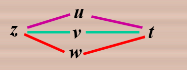
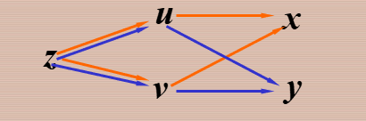

# 多元函数的求导法则

首先$z=f(u,v)$  $u,v$是复合函数的中间变量

- 复合函数中间变量都是一元函数的情形

函数$u=\phi(t),v=\psi(t)$  在 $t$ 点可导，函数$z=f(u,v)$   在对应点$(u,v)$具有连续偏导数，则复合函数$z=f[\phi(t),\psi(t)]$在对应点可导，其导数

​     $\frac{dz}{dt}=\frac{\partial z}{\partial u}\frac{du}{dt}+\frac{\partial z}{\partial v}\frac{dv}{dt}$    

- 复合函数中间变量均为多元函数的情形

函数           $z=f[\phi(x,y),\psi(x,y)]$       $u=\phi(x,y)$    $v=\psi(x,y)$

$u$和$v$ 都在$(x,y)$具有对$x和y$  的偏导数，且函数$z=f(x,y)$ 在对应点$(u,v)$具有连续偏导数，则复合函数  $z=f[\phi(x,y),\psi(x,y)]$  在对应点$(x,y)$的两个偏导数都存在，

  $\frac{\partial z}{\partial x }=\frac{\partial z }{\partial u}\frac{\partial u}{\partial x}+\frac{\partial z }{\partial v}\frac{\partial  v}{\partial x }$

$\frac{\partial z}{\partial y}=\frac{\partial z}{\partial u}\frac{\partial u}{\partial y}+\frac{\partial z}{\partial v}\frac{\partial v}{\partial y}$

- 复合函数的中间变量既有一元函数，又有多元函数的情形

  $z=f(u,v)$                  $u=\phi(x,y)$        $\psi(y)$   

  条件都是要可导，内导，且复合函数$z=f(u,v)$在点$(x,y)$的两个偏导数都存在

  $\frac{\partial z}{\partial x}=\frac{\partial z \partial u}{\partial u \partial x}$

$\frac{\partial  z}{\partial y}=\frac{\partial z \partial u}{\partial u \partial y}+\frac{\partial z \partial v}{\partial v \partial y}$

# 全微分的不变性

$z=f(u,v)$ 具有连续偏导数，则有全微分 $dz=\frac{\partial z}{\partial u}du+\frac{\partial z}{\partial v}dv;$当$u=\phi(x,y) ,v=\psi(x,y)$ 

也可以为$dz=\frac{\partial z}{\partial x}dx+\frac{\partial z}{\partial y}dy$  

推导:

$dz=\frac{\partial z}{\partial x}dx+\frac{\partial z}{\partial y}dy$   

=$(\frac{\partial z}{\partial u}\frac{\partial u}{\partial x}+\frac{\partial z}{\partial v}\frac{\partial v}{\partial x})dx$+$(\frac{\partial z}{\partial v}\frac{\partial v}{\partial y}+\frac{\partial z}{\partial v}\frac{\partial v}{\partial y})dy$

=$(\frac{\partial u}{\partial x}dx+\frac{\partial u}{\partial y}dy)\frac{\partial z}{\partial u}+\frac{\partial z}{\partial v}(\frac{\partial v}{\partial x}dx+\frac{\partial v}{\partial y}dy)$

=$\frac{\partial  z}{\partial  u}du+\frac{\partial z}{\partial  v}dv$

