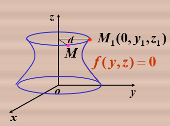
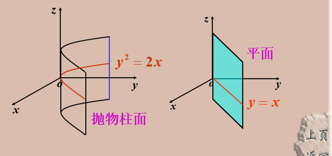
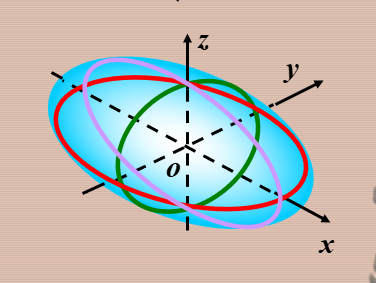
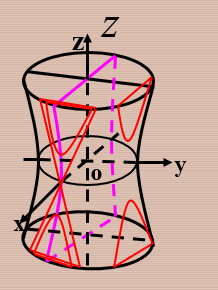
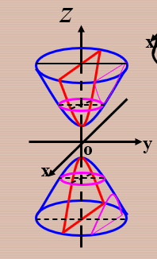
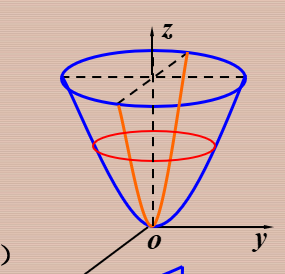
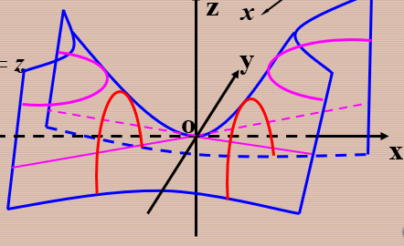

## 曲面方程

曲面上任一点都满足$F(x,y,z)=0$  

## 旋转曲面

定直线叫做旋转曲面的轴，

已知$f(y,z)=0$围绕着$z$轴旋转一周，

点$M$到$z$轴的距离$d=|\sqrt{x^2+y^2}|=|y_1|$   这个函数图像和解析式没变，依然可以成立只是$y$的空间位置变了(旋转一周)，

$f(y_2,z_1)=0$    所以$f(\pm\sqrt{x^2+y^2},z)=0$   这是$yoz$ 上的平面曲线绕$z$轴旋转一周的曲面方程

$yoz$坐标平面上的曲线绕$y$轴旋转一周的曲线为

$f(y, \pm \sqrt{x^{2}+z^{2}})=0$

其余同理，只要绕哪个轴，那个轴的变量就不变

推广：：

### 旋转双曲面

双曲线$\frac{x^{2}}{a^{2}}-\frac{z^{2}}{c^{2}}=1$  

绕$x$轴旋转 $\frac{x^2}{a^2}-\frac{y^2+z^2}{c^2}=1$

绕$z$轴旋转 $\frac{x^2+y^2}{a^2}-\frac{z^2}{c^2}=1$   

## 柱面

定义 平行于定直线并沿定曲线$C$移动的直线$L$ 所形成的曲面称为柱面

定曲线 -------->准线

动直线--------->母线

==缺那个字母 就 母线平行于$z$轴 ==准线就是这个方程==

$\frac{y^2}{b^2}+\frac{z^2}{c^2}=1$   椭圆柱面 $\parallel x$轴

$\frac{x^2}{a^2}-\frac{y^2}{b^2}=1$  双曲柱面 $\parallel z$轴

$x^2=2pz$         抛物柱面 $\parallel y $ 轴

## 二次曲面

**三元二次方程**  

**平面称为一次曲面**

截痕法

(1)椭圆锥面

$\frac{x^2}{a^2}+\frac{y^2}{b^2}=z^2$

(2)椭球面

$\frac{x^2}{a^2}+\frac{y^2}{b^2}+\frac{z^2}{c^2}=1$

$\frac{x^2}{a^2}+\frac{y^2}{b^2}-\frac{z^2}{c^2}=1$

椭球面于三个坐标面的交线都为椭圆

平面$z=z_1$  的交线也为椭圆

几种特殊情况：                      旋转椭球面

(1) a=b, $\frac{x^2}{a^2}+\frac{y^2}{a^2}+\frac{z^2}{c^2}=1$ 

由椭圆 $\frac{x^2}{a^2}+\frac{z^2}{c^2}=1$  绕$z$轴旋转而成

也可以是 $\frac{y^2}{a^2}+\frac{z^2}{c^2}=1$  绕$y$轴旋转而成

==区别==

 ==旋转椭球面与平面$z=z_1$的交线为圆==

$a,b,c$相等就是球面

(3)单叶双曲面

(4)双叶双曲面

$\frac{x^2}{a^2}+\frac{y^2}{b^2}-\frac{z^2}{c^2}=-1$  

(5)椭圆抛物面

$\frac{x^2}{a^2}+\frac{y^2}{b^2}=z$

(6)双曲抛物面(马鞍面)

$\frac{x^2}{a^2}-\frac{y^2}{b^2}=z$

