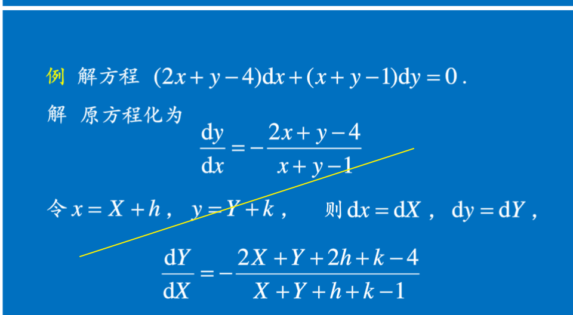
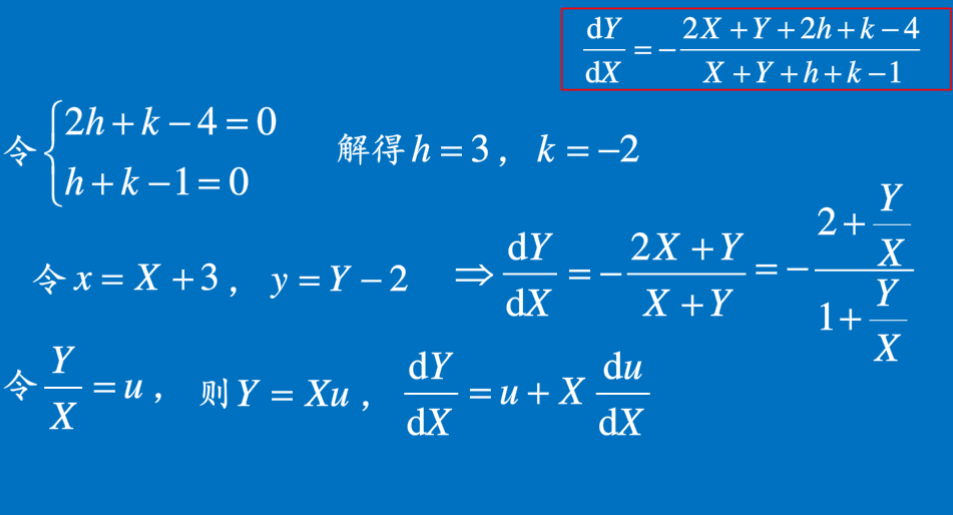
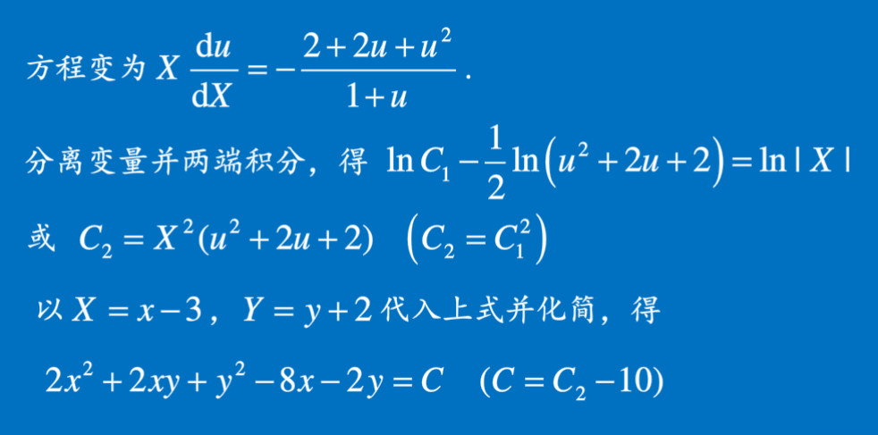

## 微分方程的定义

定义   一般地,凡表示==未知函数==,未知函数的==导数==与自变量之间的==关系的方程==,叫做微分方程,简称方程.

​        微分方程中所出现的未知函数的==最高阶导数的阶数==,叫做微分方程的阶.

$\frac{dy}{dx}=2x$是一阶微分方程      $\frac{d^2s}{dt^2}=-0.4$是二阶微分方程  

$y^(4)-4y'''+10y''-12y'+5y=sin2x$是四阶微分方程

## 微分方程的解

定义  设函数  $ y=\phi(x)$  在区间$I$上有 n  阶连续函数,如果在区间$I$上,

$F[x,\phi(x),\phi'(x),\phi''(x)....,\phi^{(n)}]=0$

那么函数$y=\phi(x)$就叫做微分方程在区间  $I$ 上的解.​

###  通解

如果微分方程的解中含有相互独立的任意常数,且==任意常数的个数与微分方程的阶数相同==,叫做微分方程的通解.

确定任意常数就得到微分方程的特解.

例如$\underline{y=x^2+C}$和$\underline{y=x^2+1}$是$\frac{dy}{dx}$在区间上的解

​                $\Downarrow$                      $\Downarrow$        

​        ==通解== 					==特解==

##  微分方程解的几何意义

微分方程的解的图形是一条曲线,称为微分方程的积分曲线.

初值问题$\begin{cases} y''=f(x,y,y') \\  \underset{x=x_0}{y|}=y_0, \underset{x=x_0}{y'|}=y_0' \end{cases}$   的几何意义:

求微分方程的通过点$(x_0,y_0)$且在该点处的切线斜率为$y_0'$的那条积分曲线.

## 可分离变量的微分方程

$g(y)dy=f(x)dx$ 形式   可分离变量

​        $\Downarrow$                  $\Downarrow$   

​     连续              连续

$(设原函数G(y)$      $(设原函数F(x))$

  设$y=\phi(x)$ 是方程的解,得  $g[\phi(x)]\phi'(x)dx =f(x)dx$  

于是   $G(y)=F(x)+C.$

$\int g(y)dy=\int f(x)dx$    

例如  

  $\frac{dy}{dx}=2xy     \Rightarrow    \frac{dy}{y}=2xdx      \Rightarrow     \int \frac{dy}{y}=\int 2xdx$

==两边积分再化简==            得出 Y  的函数

******

## 齐次方程

### 定义

 形如    $\underline{\frac{dy}{dx}=\phi(\frac{y}{x})}$  的一阶微分方程称为==齐次微分方程== ,简称   ==齐次方程.==

例如, $(xy-y^2)dx -\left(x^2-2xy\right)dy=0$

可化为    $\frac{dy}{dx}=\frac{xy-y^2} {x^2-2xy} $  即为

$****\frac{dy}{dx} =  \frac{\frac{y}{x}-\left(\frac{y}{x}\right)^2} {1-2\frac{y}{x}}****$

***

###  解法

先令$u=\frac{y}{x}$ , $y=ux $, $\underline{\frac{dy}{dx}=u+x\frac{du}{dx}}$

​                                                        $ \Downarrow $            此为关于 x 求导

代入原方程  得   $u+x\frac{du}{dx} = \phi(u),   \Rightarrow$                                                           

$\int \frac{du}{\phi(u)-u}  =  \int \frac{dx}{x} $   再代换.....

***

###  可化为齐次的方程

方程    
$$
\frac{dy}{dx}=\frac{ax+by+c}{a_1x+b_1y+c_1}
$$
==当   c=c_1=0  时,是齐次的,否则不是其次的==

在非齐次的情况下,第一种情况                  $\frac{a_1}{a}\neq\frac{b_1}{b}$

令  x=X+h,  y=Y+k,  其中h及k是待定的常数,  dx=dX , dy=dY.
$$
\frac{dY}{dy}  =\frac{aX+bY+ah+bk+c}{a_1+b_1Y+a_1h+b_1k+c_1}
$$
令 $\begin{cases} ah+bk+c=0 \\  a_1h+b_1k+c_1=0 \end{cases} $

​                                             $\Downarrow$    
$$
\frac{dY}{dX} = \frac{aX+bY}{a_1x+b_1Y}
$$
此时   X=x-h, Y=y-k,

***

第二种情况      $\frac{a_1}{a}=\frac{b_1}{b}=\Lambda$  

则   $\frac{dy}{dx}=\frac{ax+by+c}{\Lambda\left(ax+by\right)+c_1}$, 令$u=ax+by$ ,关于 x 求导

$\frac{du}{dx}=a+b\frac{dy}{dx}$    $\Rightarrow  \frac{1}{b}\left(\frac{du}{dx}-a\right)  =\frac{u+c}{\Lambda u+c_1}$,   ==可分离变量的方程==

***

## 一阶线性微分方程

### 线性方程

形如        $\frac{dy}{dx}+P(x)y=Q(x)$      的方程称为==一阶线性微分方程==

$\begin{cases} Q(x)=0 &齐次 \\  Q(x)\neq0 &非齐次\end{cases}$   

对应于 $Q(x)\neq0$  非齐次线性方程的齐次线性方程,是可分离变量的 ,

$\frac{dy}{y}=-P(x)dx$   ==两端积分==

$\ln|y|=-\int P(x)dx+C_1$   ,$\underline{y=Ce^{-\int P(x)dx}  (C=\pm e^{c_1})}$

==常数变易法==             

$y=u(x)e^{-P(x)dx}   $                  $\Rightarrow$        $\frac{dy}{dx}=u'e^{-\int P(x)dx}-uP(x)e^{-\int P(x)dx}$ 

带入得   $u'e^{-\int P(x)dx}=Q(x)$     $\Rightarrow$     $u'=Q(x)e^{\int P(x)dx}$

得  $u=\int Q(x)e^{\int P(x)dx}$
$$
\underline{y=e^{-\int P(x)dx}\left(\int Q(x)e^{\int P(x)dx}dx + C\right)}
$$
​                                                                              $\Downarrow$ 

​                                                       $\underline{y=Ce^{-\int P(x)dx}}+\underline{e^{-\int P(x)dx}\int Q(xe^{\int P(x)dx}dx}$

​                                                          $\Downarrow$                                                       $\Downarrow$

​                                         ==齐次线性方程得解==      							==非齐次线性方程得一个特解==

***

### 多个方法解题

例子   解==$\frac{dy}{dx}=\frac{1}{x+y}$===   $\Rightarrow$         $\frac{dx}{dy}-x=y$     $\Rightarrow  \frac{dx}{dy}+P(y)x=Q(y) $  的一阶线性方程

方法一    公式法

方法二   常数变易

==方法三==    变量代换法      

令$x+y=u$  

$\frac{dy}{dx}=\frac{u}{x}-1$    ,带入得  $\frac{du}{dx}=\frac{u+1}{u}$   $\Rightarrow$     $\frac{udu}{u+1}=dx$    

得 $u- \ln (u+1) = x+C_1  $     

代入得 ,,,,   $x=Ce^y-y-1$

***

### 伯努利方程

形如      $\frac{dy}{dx}+P(x)y=Q(x)y^n(n\neq0,1)$

当$n=0或n=1时$,线性微分方程

当$n\neq0或n\neq1时$ ,不是线性的

但是通过==变量代换==,可以转换为线性的

两端除以    $y^n$  

$y^{-n} \frac{d y}{d x}+P(x) y^{1-n}=Q(x), \quad \frac{d}{d x}\left(y^{1-n}\right)=(1-n) y^{-n} \frac{d y}{d x}$

$\hat{\succcurlyeq} z=y^{1-n}, \frac{\mathrm{d} z}{\mathrm{d} x}=(1-n) y^{-n} \frac{\mathrm{d} y}{\mathrm{d} x}$

$\frac{d z}{d x}+(1-n) P(x) z=(1-n) Q(x)$     ---------------------==线性方程==

   

